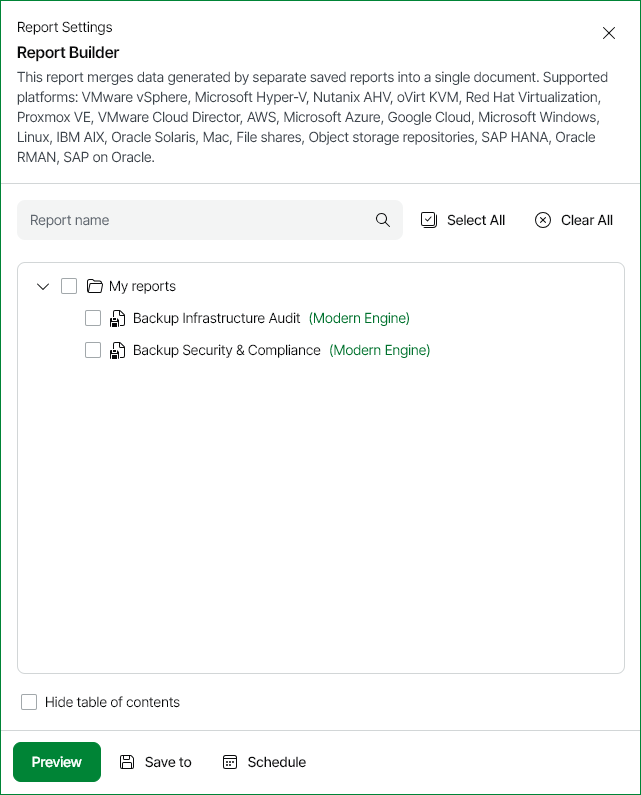

# Report Builder

This report merges data generated by separate custom reports into a single document.

To use the Report Builder, you first need to configure and save custom reports in the My reports folder. The Report Builder will then offer you to include different sections from the saved reports into the resulting report providing you a consolidated view of core virtual environment properties.

Report Parameters

You can specify the following report parameters:

* My Reports: select the saved reports that should be included in the resulting custom report.
* Hide table of contents: defines whether the report output will include table of contents or display results in the expanded view.

Use Case

This report eliminates data redundancy and helps you focus on the most relevant and important information about your infrastructure.

Page updated 2026-07-29

