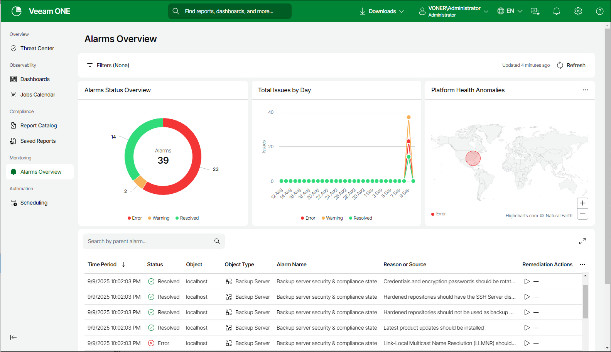

# Alarms Overview

The Alarms Overview dashboard provides a centralized overview of all active and historical Veeam Backup & Replication alarms within the system, allowing users to quickly assess the current health and status of monitored resources. It displays key metrics such as the number of error, warning, resolved, information and acknowledged alarms, along with their timestamps, affected components, and severity levels.

To improve your alarm data displayed you can also use the filter panel to refine the information displayed by filtering alarms by status, object type and remediation action as well as specifying the time period to display all associated data. Applied filters are immediately reflected in the displayed data.

You can access the Alarms Overview dashboard from the main navigation bar in Veeam ONE Web Client.

Widgets Included

Alarms Status Overview

This widget shows all currently triggered alarms within the system, providing real-time visibility into ongoing issues that require attention. The chart is broken down into details of all current alarms that have the status of Error, Warning, Resolved, Information and Acknowledged.

Total Issues by Day

This widget shows a daily summary of all issues detected within the system over a selected time period. This view helps users track trends and patterns in system health by displaying the number of new issues identified each day.

Platform Health Anomalies

This widget shows alarms detected by geographic location based on alarm severity. This view helps users track alarm trends in system health by displaying the number of issues identified in each configured geographic location.

Alarms list

This table provides a detailed, filterable list of all alarms. It displays essential information for each alarm in the following columns: Time Period, Status, Object, Object Type, Alarm Name, and Reason or Source. You can also click on any alarm entry to provide additional details and acknowledge, resolve and approve alarms. For details, see [Resolving Individual Alarms](resolve_single_alarms.md), [Acknowledging Individual Alarms](acknowledge_single_alarms.md) and [Approving Actions for Individual Alarms](remediate_single_alarms.md).

