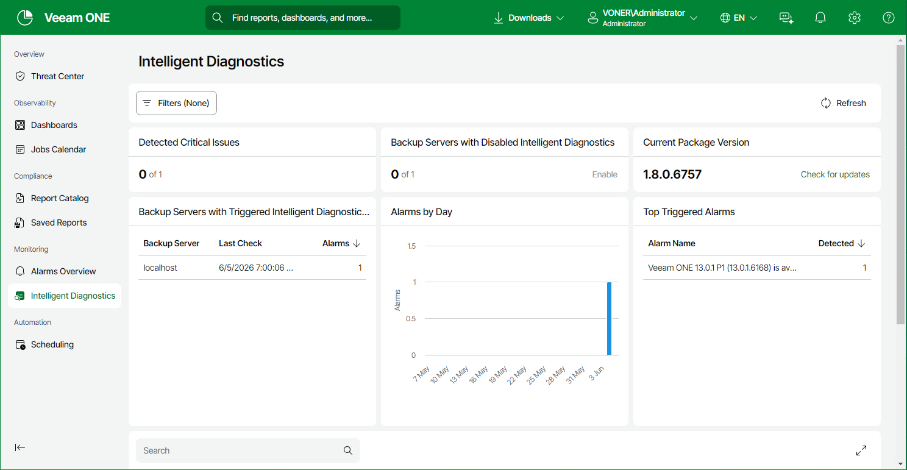

# Intelligent Diagnostics

The Intelligent Diagnostics dashboard in Veeam ONE Web Client gives you a single view of Veeam Intelligent Diagnostics (VID) activity across all connected Veeam Backup & Replication servers. It brings together the currently triggered VID alarms, the installed signature package version and the VID enablement status of each server, so you can review the diagnostic state of your backup infrastructure in one place.

To open the dashboard, select Intelligent Diagnostics in the main navigation bar of Veeam ONE Web Client.

Use the Filters panel at the top of the dashboard to scope the view by infrastructure objects and by time period: Last 24 hours, 7, 14 or 30 days, or a custom range. The time period applies only to the historical widgets — Alarms by Day, Top Triggered Alarms and the alarms list. The current-state widgets — Detected Critical Issues, Backup Servers with Disabled Intelligent Diagnostics, Current Package Version and Backup Servers with Triggered Intelligent Diagnostics Alarms — always show real-time values and are not affected by the selected time period.

Widgets Included

Detected Critical Issues

Shows how many of the currently triggered VID signatures are critical, alongside the total count. New-version-release signatures are not counted as critical.

Backup Servers with Disabled Intelligent Diagnostics

Shows how many of the Veeam Backup & Replication servers that support VID have it disabled. To enable VID on those servers, click the Enable link. The Data Collection Overview tab opens with the disabled servers preselected. For more information, see [Data Collection](one_server_configuration.md).

Current Package Version

Shows the version of the currently installed VID signature package and the time of the last update check. Click Check for updates to manually check for a newer signature package. For more information on automatic updates, see [Managing Signatures](manage_support_signatures.md).

Backup Servers with Triggered Intelligent Diagnostics Alarms

Lists backup servers on which VID signatures triggered, with the following columns: Backup Server, Last Check and Alarms. The values are real-time and are not affected by the dashboard filter time period.

Alarms by Day

Shows the number of VID alarms triggered each day as a bar chart. The date range follows the time period selected in the dashboard Filter panel.

Top Triggered Alarms

Ranks the most frequently triggered VID signatures over the selected time period, showing the signature name and the number of detections.

Alarms List

Lists VID alarms with the following columns: Time, Status, Object, Object Type and Alarm Name. Use the search box above the table to filter the entries. Click an alarm entry to open a side panel with its details. For more information on alarm details, see [Alarms Overview](reporter_alarms_overview.md). The list follows the scope and time period selected in the dashboard Filter panel.

Page updated 2026-07-10

