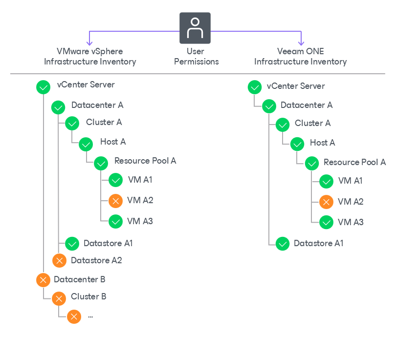

# How Access to Virtual Infrastructure Objects is Restricted

Veeam ONE collects inventory details about virtual infrastructure objects from connected VMware vSphere and VMware Cloud Director servers. In addition to objects and object properties, Veeam ONE gathers information about user permissions assigned to objects in VMware vSphere and VMware Cloud Director inventories. Permission details are gathered in real time, as part of the regular data collection procedure.

Collected permissions determine what users must (and must not) have access to objects in the Veeam ONE virtual infrastructure inventory. When a user authenticates to Veeam ONE, Veeam ONE checks what permissions are assigned to objects in the VMware vSphere and VMware Cloud Director inventories.

* If the user has appropriate permissions on an object, the user can access this object and associated data in the Veeam ONE infrastructure inventory.
* If the user does not have permissions on an object, the object is hidden. Data associated with this object is unavailable to the user.

