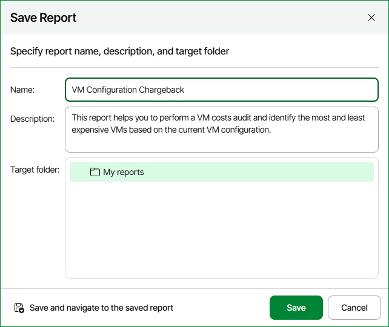

# Saving Reports

You can create reports with custom parameters and save them for future use:

1. Open Veeam ONE Web Client.
2. Open the Report Catalog section.
3. In the displayed list of reports, click the necessary report.
4. Specify the report parameters, such as the virtual or backup infrastructure scope, reporting period and so on.
5. At the bottom of the report parameters, click Save to.
6. In the Save Report window, specify the report name and description and select a folder to which you want to place the report.

You can only select the My reports folder or another folder that you have previously created. You cannot save reports to folders that include predefined reports. For details on working with folders, see [Organizing Reports](organize_reports.md).

1. Click Save.

If you want to open the report after saving, click Save and navigate to the saved report.

|  |
| --- |
| Note: |
| A saved report can become unavailable if you change the Veeam ONE license. |

