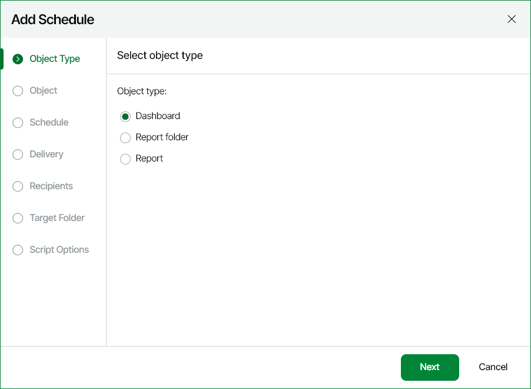
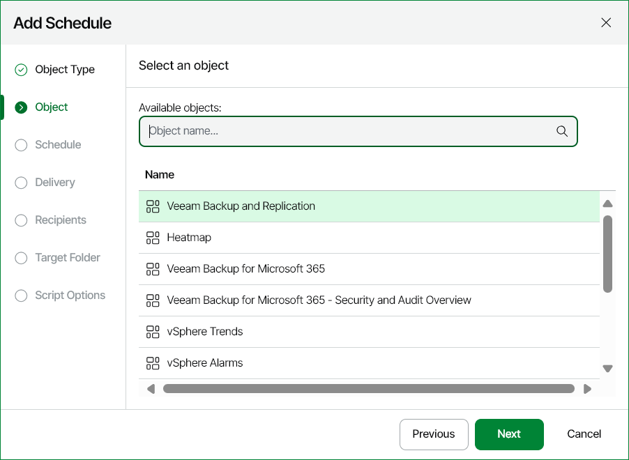
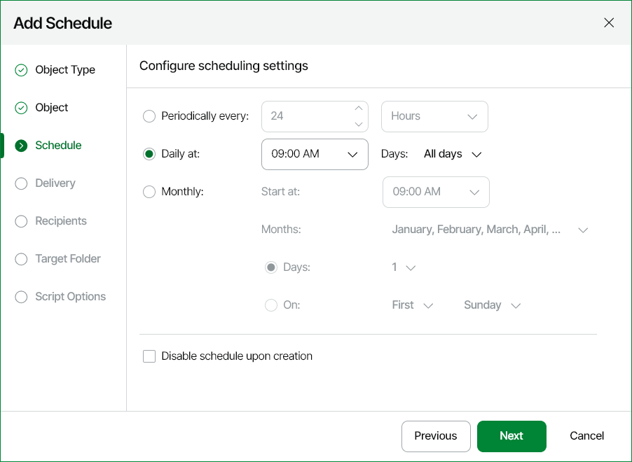
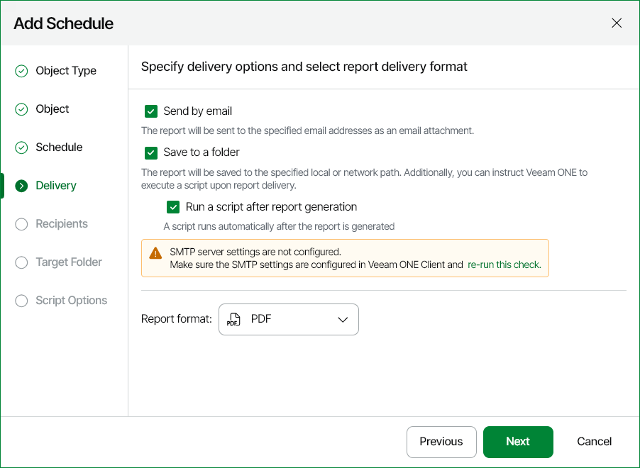
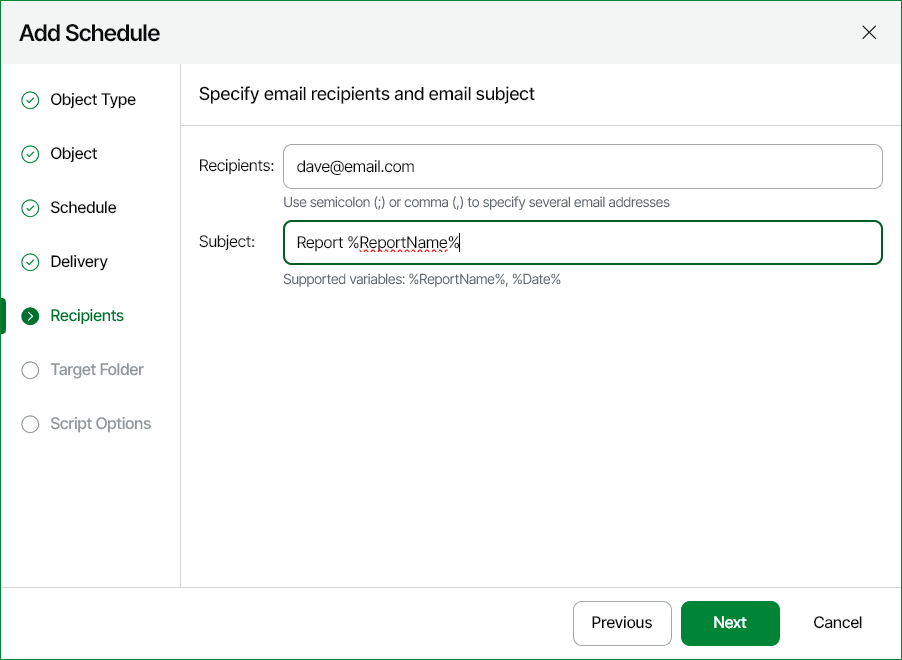
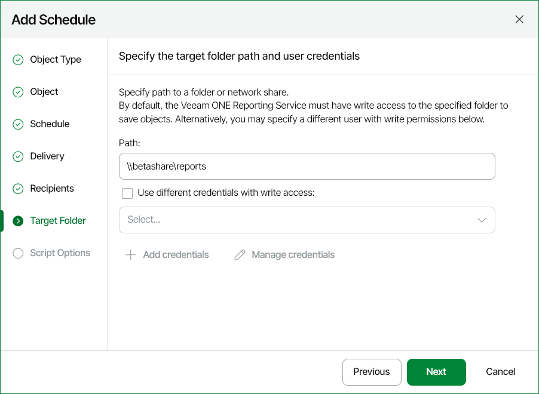
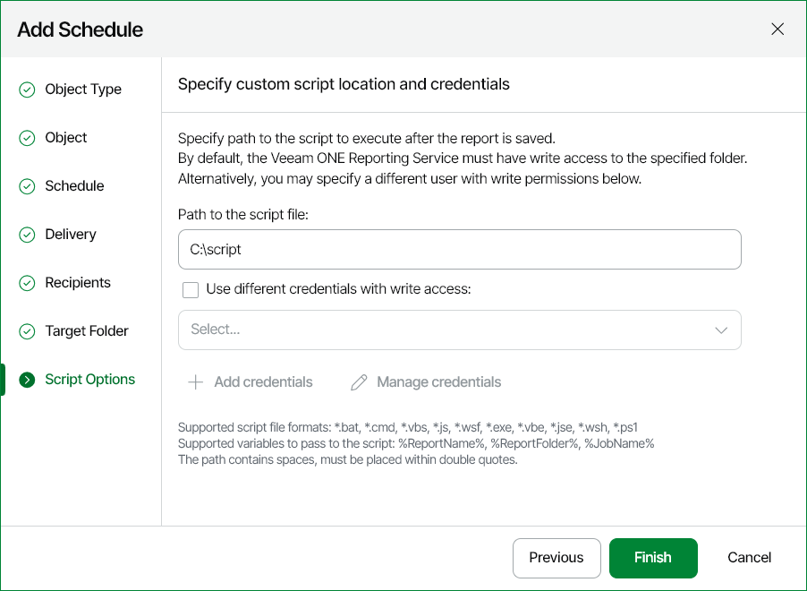

# Scheduling

In Veeam ONE Web Client, you can schedule automatic delivery for dashboards, reports and report folders. You can choose to receive dashboards and reports by email, save dashboards and reports to a local folder or network share. Note that you can only schedule delivery for saved reports (that is, reports in the My Reports folder and its subfolders).

To schedule delivery for dashboards, reports and report folders:

1. Open Veeam ONE Web Client.
2. Open the Scheduling section.
3. At the top of the list, click Add.

Veeam ONE Web Client will launch the Add Schedule wizard.

1. At the Object Type step of the wizard, specify the type of object for which you want to enable scheduled delivery.

1. At the Object step of the wizard, select the dashboard, report or report folder for which you want to enable scheduled delivery.

1. At the Schedule step of the wizard, define a schedule according to which the object must be generated and delivered.

* To generate and deliver the object repeatedly, with a specific time interval, select the Periodically every option and define the necessary interval.
* To generate and deliver the object at specific time of day, select the Daily at option and specify the time and days of week on which the object must be delivered.
* To generate and deliver the object on a monthly basis, select the Monthly option and choose the necessary months, dates or weekdays.
* To configure a schedule without enabling it, select the Disable schedule upon creation check box.

You can enable the schedule later. For details on, see [Managing Delivery Schedules](manage_schedule.md).

1. At the Delivery step of the wizard, define object delivery options:

* Select the Send by email check box to send objects by email.

If this option is selected, the Recipients step will become available in the wizard.

If you want to send objects by email, make sure you specified SMTP settings in Veeam ONE Client. For details on, see [Configure SMTP Server Settings](notification_smtp_server.md).

[For the Dashboard object type] Additionally, you can select whether you want to attach a dashboard file to an email message or embed it into an email body.

[For the Report folder object type] If you want to send several reports from the folder in a single email, select the Send multiple reports in a single email check box and specify the maximum number of reports to include in a single email. If the number of reports in the folder exceeds the specified maximum, Veeam ONE Web Client will send several emails.

* Select the Save to a folder check box to save objects to a network share or a local folder on a machine where Veeam ONE Server component runs.

With this option selected, the Add Schedule wizard will include an additional Target Folder step.

* Select the Run a script after report generation check box to run a script file after generation is complete.
* [For the Report folder and Report object types] From the Report format drop-down list, select the format in which the report must be saved. You can choose one of the following formats: PDF, MS Word, MS Excel, CSV, XML.

Reports generated in Veeam ONE version 13's new report engine are only generated in PDF and CSV.

To save reports in CSV or XML format, you must configure an SRSS server. For details on, see [Configuring SSRS Server Settings](configure_ssrs_server_settings.md).

1. At the Recipients step of the wizard, configure object delivery by email:

1. In the Recipients field, specify the recipient email address.

If you want to send generated objects to multiple recipients, separate email addresses with a semicolon (;) or comma (,).

1. In the Subject field, specify an email subject title.

You can use the %ReportName% %DashboardName% and %Date% variables in the subject line — Veeam ONE will substitute these variables with the name of a delivered report, dashboard and the current date.

1. At the Target Folder step of the wizard, configure automated delivery to a local folder or a network share:

1. In the Path field, specify a path to a local folder or network share.

The path must refer to an existing folder. Veeam ONE will check if the specified folder exists and if the account under which Veeam ONE Reporting service runs has write permissions on the folder.

1. Select the Use different credentials with write access check-box to select an alternative credentials account with access to the file path if required.

|  |
| --- |
| Note |
| The Use different credentials with write access option is only available for Veeam ONE Administrator accounts. For details, see [Permissions and Security Groups](permissions_vs_security_groups.md). |

1. At the Script Options step of the wizard, configure the script file save path:

1. In the Path to the script file field, specify a path to the script file location.

The path must refer to an existing folder. Veeam ONE will check if the specified folder exists and if the account under which Veeam ONE Reporting service runs has write permissions on the folder.

1. Select the Use different credentials with write access check-box to select an alternative credentials account with access to the file path if required.

1. Click Finish.

If you want to configure multiple schedules, repeat steps 4–10 for each new schedule.

