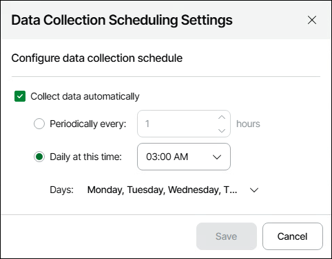

# Scheduling Data Collection

By default, data for Veeam ONE Web Client and Business View reporting data is collected automatically, according to a predefined schedule. Data collection runs on weekdays at 3:00 a.m. This schedule applies to all Veeam Backup & Replication, Veeam Backup for Microsoft 365 and virtualization servers that are managed by Veeam ONE. For details on data collection sessions, see [Viewing Data Collection Session Details](view_collection_details.md).

You can change the default data collection schedule or disable the schedule.

Changing Data Collection Schedule

To change the schedule according to which data collection will start:

1. Open Veeam ONE Web Client.
2. At the top right corner of the Veeam ONE Web Client window, click Configuration.
3. In the configuration menu on the left, click Data Collection.
4. Click Advanced Actions and choose Schedule report data collection.
5. Make sure the Collect data automatically check box is selected.
6. Set the schedule according to which data collection must start.

* To run data collection with specific time intervals, select the Periodically every N hours option and specify the interval at which data collection must start. If you choose to run data collection periodically, make sure that the interval between data collection sessions is long enough to collect data from all connected servers.

* To run data collection every day at specific time, select the Daily at this time option and specify the time of the day when data collection must start. In the Days section, select days of week on which data collection must run.

1. Click Save.

After you schedule automatic data collection, the schedule type for the Object properties collection task will be set to Daily or Periodic. The task will start data collection according to the specified schedule.

Disabling Data Collection

You can disable automatic data collection for Veeam ONE Web Client, and perform data collection manually. To learn how to perform data collection manually, see [Running Data Collection Manually](run_data_collection.md).

To disable automatic data collection:

1. Open Veeam ONE Web Client.
2. At the top right corner of the Veeam ONE Web Client window, click Configuration.
3. In the configuration menu on the left, click Data Collection.
4. Click Advanced Actions and choose Schedule report data collection.
5. Clear the Collect data automatically check box.
6. Click Save.

