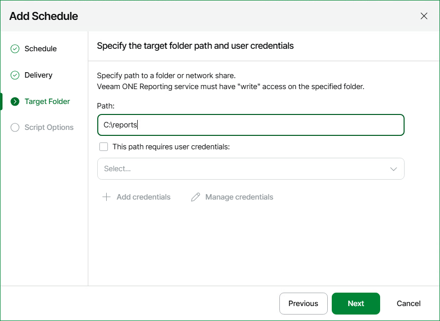

# Example A. Copying a Report to Network Shares

Consider the following scenario: your backup administrators want to obtain a weekly report with the list of protected VMs in your virtual environment. To deliver the Protected VMs report to backup administrators on a weekly basis, you can take the following steps:

1. [Save the Protected VMs report with the necessary parameters](script_example_a.md#step1).
2. [Create a script that will copy the report to network shares of backup administrators](script_example_a.md#step2).
3. [Set the necessary schedule for the report and specify the post-delivery script](script_example_a.md#step3).

Step 1. Save Protected VMs Report

Save the Protected VMs report with the necessary parameters as described in [Saving Reports](save_reports.md).

Step 2. Create Script

When you schedule a report delivery to a folder or a network share, Veeam ONE Web Client saves the generated report to a target location by the following path:

<TargetDirectory>\reporting-task-for-ssrs-report-<ReportName><ID>\

The sample script must perform the following operations after the report is created:

1. Access the target report location:

C:\reports\reporting-task-for-ssrs-report-<ReportName><ID>\

1. Copy the report from the target location to network shares:

* \\andy\shared\backups\reports\
* \\brian\shared\backups\reports\
* \\chris\shared\backups\reports\

1. Remove the report from the target location and delete the target directory.

An example of the script is provided below:

|  |
| --- |
| ::Changing directory to the target report location |

Save the script as a Windows batch file on the machine where Veeam ONE Server is installed.

To follow this example, save the script with the postdelivery.bat name to the C:\reports\ directory.

Step 3. Configure Scheduling Settings

Before scheduling report delivery, make sure that:

* The account under which the Veeam ONE Reporter Server service runs has appropriate write permissions on the destination network shares.
* Object properties data collection task that gathers data from virtual infrastructure and Veeam Backup & Replication servers completes before the scheduled report generation time.

Configure scheduling settings for the saved report as follows:

1. Open Veeam ONE Web Client.
2. Open the Saved Reports section.
3. On the saved report or report folder, right-click the necessary folder and select Schedule in the context menu.
4. In the Report Scheduling Settings window, click Add.

Veeam ONE Web Client will launch the Add Schedule wizard.

1. In the Add Schedule window, configure automatic delivery settings as follows:

1. At the Schedule step of the wizard, create a schedule according to which the report should be generated. To follow this example, schedule the report to run on a weekly basis.

1. At the Delivery step of the wizard, select only the Save to a folder check box.
2. At the Target Folder step of the wizard, specify target folder details. In the Path field, enter the path to the folder where the generated report will be stored.
3. In the Script Options step, specify the location of the script file in the Path to the script file field.
   To follow this example, enter C:\reports in the Path field and enter C:\reports\postdelivery.bat in the Path to the script file field.

1. Save the scheduling settings.

Expected Result

The report will be generated and copied in accordance with the specified schedule.

At the specified schedule time, Veeam ONE Web Client will automatically generate the report. After the report is created, Veeam ONE Web Client will trigger the script that will copy the report to network shares.

