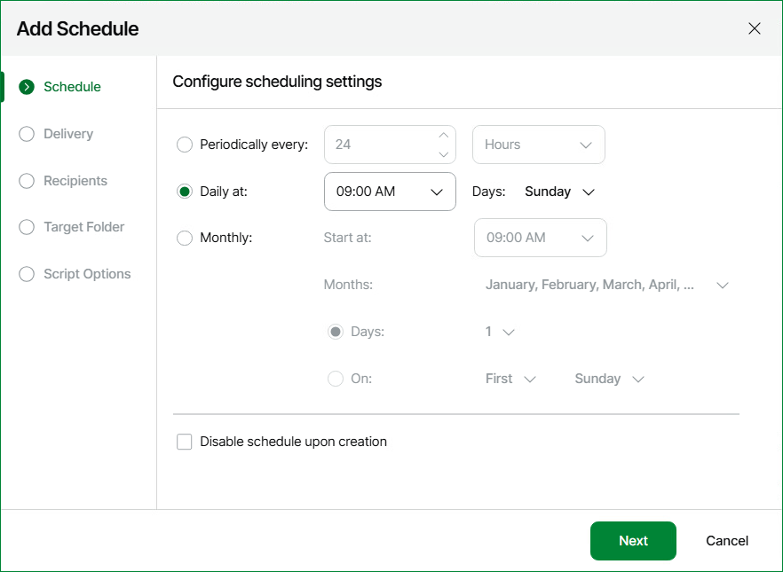
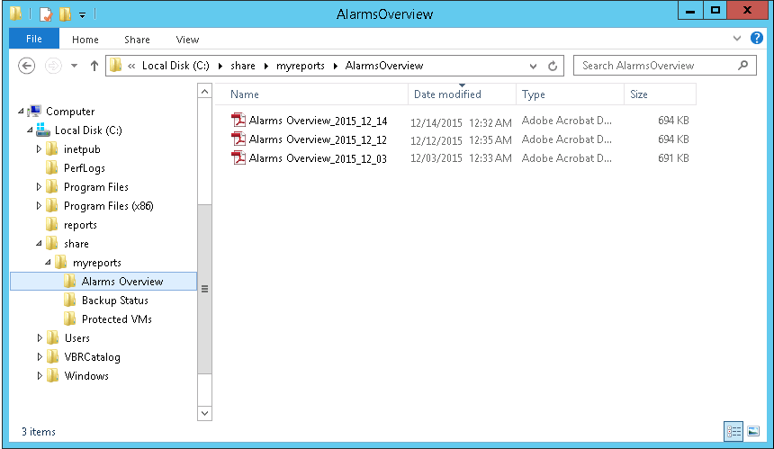

# Example B. Sorting Reports by Name

Consider the following scenario: you want to schedule a weekly delivery for a set of reports. After the reports are created, you want to save each report to a separate folder with the report name.

To sort reports into folders by report name, you can take the following steps:

1. [Create a folder that will group a set of necessary reports](script_example_b.md#step1).
2. [Save reports with the necessary parameters into the folder](script_example_b.md#step2).
3. [Create a script that will sort the generated reports](script_example_b.md#step3).
4. [Set the necessary schedule for the folder and specify the post-delivery script](script_example_b.md#step4).

Step 1. Create Folder

Create a report folder as described in [Creating Folders](create_folders.md). The folder will be used to group a set of reports that you want to create on a scheduled basis.

Step 2. Save Reports

Save reports with the necessary parameters as described in section [Saving Reports](save_reports.md).

Step 3. Create Script

When you schedule a report delivery for set of reports in a folder, Veeam ONE Web Client saves the reports to a target location by the following path:

<TargetDirectory>\reporting-task-for-folder-<FolderName><ID>\

The sample script must perform the following operations:

1. Access the target report location:

C:\reports\reporting-task-for-folder-<FolderName><ID>\

1. For every generated report, retrieve the report name and copy the report to a folder with the report name:

C:\share\myreports\%ReportName%\

To create a folder with the report name, the script will use the %ReportName% parameter.

1. Remove the reports from the target location and delete the target directory.

An example of the script is provided below:

|  |
| --- |
| ::Changing directory to the target report location |

Save the script as a Windows batch file on the machine where Veeam ONE Server is installed.

To follow this example, save the script with the postdelivery.bat name to the C:\reports\ directory.

Step 4. Configure Scheduling Settings

Configure scheduling settings for the saved report as follows:

1. Open Veeam ONE Web Client.
2. Open the Saved Reports section.
3. On the saved report or report folder, right-click the necessary folder and select Schedule in the context menu.
4. In the Report Scheduling Settings window, click Add.

Veeam ONE Web Client will launch the Add Schedule wizard.

1. In the Add Schedule window, configure automatic delivery settings as follows:

1. At the Schedule step of the wizard, create a schedule according to which the report should be generated. To follow this example, schedule the report to run on a weekly basis.

1. At the Delivery step of the wizard, select only the Save to a folder check box.
2. At the Target Folder step of the wizard, specify target folder details. In the Path field, enter the path to the folder where the generated report will be stored.
3. In the Script Options step, specify the location of the script file in the Path to the script file field.
   To follow this example, enter C:\reports in the Path field. In the Path to the script file field, enter the path to the script and pass the report name parameter to the script: C:\reports\postdelivery.bat %ReportName%

1. Save the scheduling settings.

Expected Result

At the specified schedule time, Veeam ONE Web Client will automatically generate the reports. When a report is created, Veeam ONE Web Client will trigger the script that will copy the report to a separate folder.

