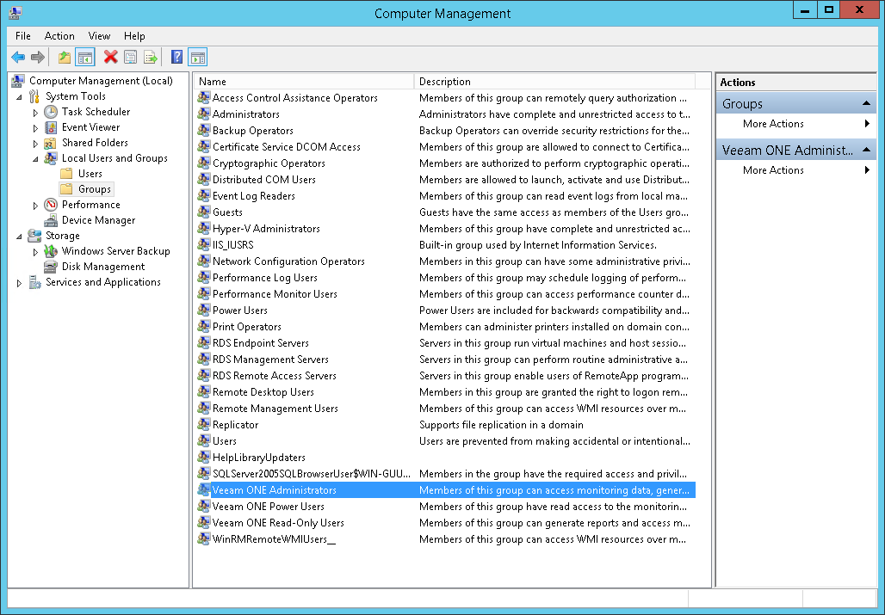

# Security Groups

Veeam ONE creates the following security groups on the machines where Veeam ONE Server and Veeam ONE Web Services components are installed:

* Veeam ONE Administrators: members of this group can access monitoring data, generate reports and modify all Veeam ONE configuration settings.

This group must include the Veeam ONE service account.

|  |
| --- |
| Note: |
| If the Windows security policy Deny access to this computer from the network is set to deny network logon for local accounts and members of the Administrators group, local administrator accounts may be assigned the Limited Scope user role in Veeam ONE Web Client.  In this situation, Veeam ONE Web Client cannot validate local administrator group membership because it relies on a Windows network logon (Logon Type 3).  To ensure proper validation and access, we recommend using only domain accounts or groups for Veeam ONE administration. |

* Veeam ONE Power Users: members of this group have full access to all Veeam ONE Web Client tabs except configuration settings and read access in Veeam ONE Client.

|  |
| --- |
| Note: |
| Members of the Power Users security group can run report and dashboard scheduling scripts on the machine on which the Veeam ONE Web Services component is installed. Include users into this group with caution. |

* Veeam ONE Read-Only Users: members of this group can generate reports and access monitoring data in read-only mode, but cannot modify any Veeam ONE configuration settings.

You can access and manage security groups in the Computer Management console.

To provide access to Veeam ONE functionality for an administrator or operator, you must include this user either in the Veeam ONE Administrators, Veeam ONE Read-Only Users or Veeam ONE Power Users group. Member of these groups have access to:

* All Veeam ONE consoles (Veeam ONE Client and Veeam ONE Web Client)

* All objects of the infrastructure inventory

|  |
| --- |
| Note: |
| To apply the changes after a user has been included to a Security Group, this user must log out and log back on to the machines where Veeam ONE Server and Veeam ONE Web Services components are installed. |

Multi-Tenant Monitoring and Reporting

Veeam ONE supports multi-user access to its monitoring and reporting capabilities. Authorized users can concurrently access the same instance of Veeam ONE to monitor the health state of the virtual infrastructure and create reports.

To restrict access to sensitive infrastructure data, you can limit the scope of virtual infrastructure objects and associated data that must be available to a Veeam ONE user. Thus you can control what subset of the managed virtual infrastructure the user can see and work with. In multi-tenant environments, you can configure restricted access to Veeam ONE for owners of virtualized systems or responsible personnel and delegate monitoring and reporting tasks.

|  |
| --- |
| Note: |
| Do not use security groups to enable for users possibilities of self-service monitoring and reporting on a restricted scope of the virtual infrastructure. Instead, configure permissions for multi-tenant access. For details, see [Multi-Tenant Monitoring and Reporting](multitenant.md). |

