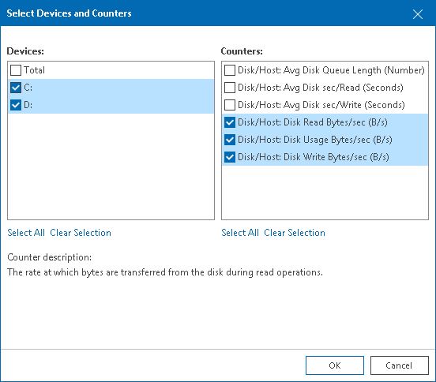

# Selecting Chart Views and Performance Counters

Performance charts come with a set of predefined chart views that logically group related performance counters. You can switch between chart views using the Chart view list at the top of the chart legend.

Instead of using predefined views, you can choose a custom set of performance counters to show on the chart:

1. Open Veeam ONE Client.

For details, see [Accessing Veeam ONE Components](access.md).

1. At the bottom of the inventory pane, click Virtual Infrastructure.
2. In the inventory pane, select the necessary infrastructure object.
3. Open the necessary performance chart.
4. In the Chart views list, select the Custom option to open the Select Devices and Counters window.
5. From the Devices list, select the necessary device(s).

Select Total to display all available devices on the chart.

|  |
| --- |
| Note: |
| The list of devices is not available for some performance charts. For example, for the CPU or Memory performance chart, you can only choose counters to display. |

1. From the Counters list, select counters to display on the chart.

When you select a counter, its description appears in the Counter description section of the window.

1. Click OK.

