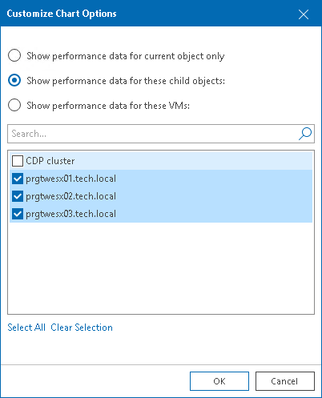
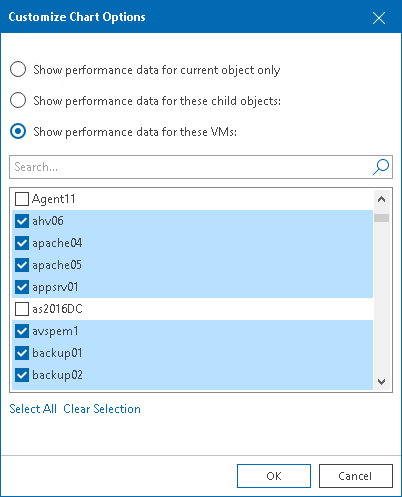

# Selecting Objects to Chart

By default, all performance charts display data for an infrastructure object selected in the inventory pane. You can also choose to display performance data on charts for:

* Child components or objects of the selected virtual infrastructure object (for example, all hosts in the cluster)
* Child VMs for the selected virtual infrastructure object or segment

To display performance data for direct children of the selected virtual infrastructure object:

1. Open Veeam ONE Client.

For details, see [Accessing Veeam ONE Components](access.md).

1. At the bottom of the inventory pane, click Virtual Infrastructure.
2. In the inventory pane, select the necessary infrastructure object.
3. Open the necessary performance chart tab.
4. From the Chart options list, select Custom.
5. In the Customize Chart Options window, choose Show performance data for these child objects.
6. Select check boxes next to child objects that should be included in the chart scope.
7. Click OK.

To display performance data for a set of VMs in the selected infrastructure segment:

1. Open Veeam ONE Client.

For details, see [Accessing Veeam ONE Components](access.md).

1. In the inventory pane, select the necessary infrastructure object.
2. Open the necessary performance chart tab.
3. From the Chart options list, select Custom.
4. In the Customize Chart Options window, choose Show performance data for these VMs.

You can select both direct and indirect children (children of children) of the selected virtual infrastructure object.

1. Select check boxes next to VMs that should be included in the chart scope.
2. Click OK.

|  |
| --- |
| Note: |
| The legend pane displays objects for which data is available for the selected time interval. |

