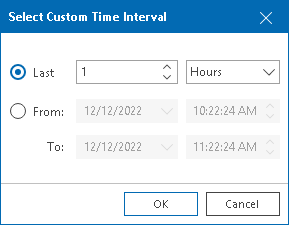

# Selecting Time Interval

You can choose the time interval for which performance data on the chart will be displayed. Available options are:

* Last hour (real-time information)
* Last day
* Last week
* Last month
* Last year
* Custom time range (you can choose any time interval within the specified number of hours, days, or weeks, or specify any from/to period)

To specify a time interval for which performance data should be displayed:

1. Open Veeam ONE Client.

For details, see [Accessing Veeam ONE Components](access.md).

1. At the bottom of the inventory pane, click Virtual Infrastructure.
2. In the inventory pane, select the necessary infrastructure object.
3. Open the necessary performance chart tab.
4. From the Period list, select Last hour, Last day, Last week, Last month or Last year.

To define a custom time range, select Custom. In the Select Custom Time Interval window, define the necessary interval and click OK.

When you change the time interval, the time scale (X-axis) of the performance chart and the chart will change respectively.

