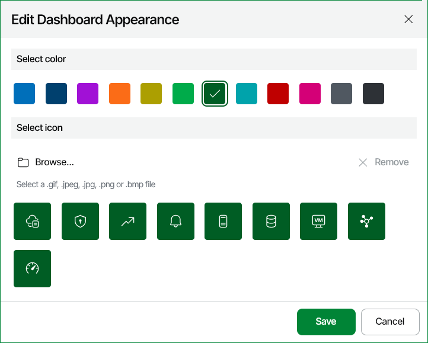

# Setting Dashboard Preview Image and Color

You can select the preview image and background color that will be used to depict the dashboard in the Dashboards section.

To set a preview image and background color for a dashboard:

1. Open Veeam ONE Web Client.
2. Open the Dashboards section.
3. At the right edge of the dashboard thumbnail, expand the Settings menu and click Edit Appearance.
4. In the Select color palette, choose the necessary background color.
5. In the Select icon list, choose an image that must depict the dashboard.

You can select a custom image preview image. To do so, click the Browse link at the top of the list and select the necessary image file. The image must be in GIF, JPEG, JPG, PNG, BMP or SVG format.

1. Click Save.

