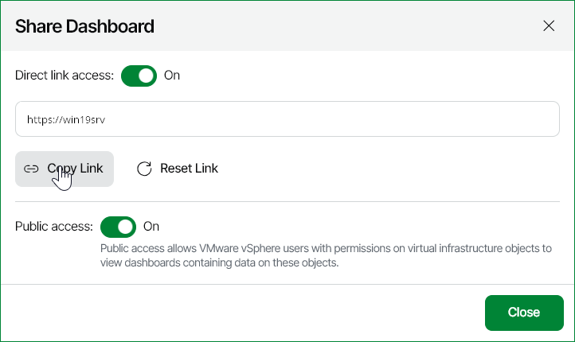

# Sharing Dashboards

To share a dashboard with other users, you can enable public access to the dashboard or generate a direct dashboard link.

Generating Direct Dashboard Link

To share a dashboard with other users, or integrate a dashboard to a web portal, you can generate a direct dashboard link:

1. Open Veeam ONE Web Client.
2. Open the Dashboards section.
3. At the right edge of the dashboard preview image, expand the Settings menu and click Share.

Alternatively, you can click the dashboard preview image to open the dashboard and click Share at the top left corner of the dashboard window.

1. In the Share Dashboard window, switch the Direct link access toggle to On.
2. Click Copy Link to copy the link and use it to share with other users or integrate to web portals.
3. If you need to generate a new direct link, click Reset Link.

Note that after you change the direct link, the previous link will become invalid.

1. Click Close.

Enabling and Disabling Public Access

To share a dashboard with other users, you can enable public access to this dashboard. Veeam ONE users, including VMware vSphere and VMware Cloud Director users who have permissions assigned on virtual infrastructure objects, can access published dashboards in the Veeam ONE Web Client.

|  |
| --- |
| Note: |
| Predefined dashboards are available for public access by default. |

To enable or disable public access to a dashboard:

1. Open Veeam ONE Web Client.
2. Open the Dashboards section.
3. At the top right corner of the dashboard preview image, expand the menu and click Share.

Alternatively, you can click the dashboard preview image to open the dashboard and click Share at the top left corner of the dashboard window.

1. In the Share Dashboard window, switch the Public access toggle to On to enable public access, or to Off to disable public access.
2. Click Close.

