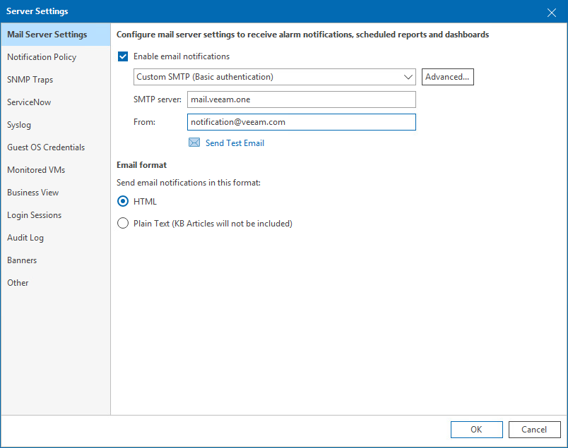

# Mail Server Settings

In mail server settings, you can configure email settings that will be used for sending alarm notifications, dashboards and reports by email.

To specify SMTP server settings:

1. Open Veeam ONE Client.

For details, see [Accessing Veeam ONE Components](access.md).

1. In the main menu, click Settings > Server Settings.

Alternatively, press [CTRL + S] on the keyboard.

1. In the Server Settings window, open the Mail Server Settings tab.
2. To configure email notification settings, select the Enable email notifications check box.

For details on configuring mail server settings, see [Configuring Notification Settings](configure_notification_settings.md).

1. In the Email format section, choose the format of email messages notifying about Veeam ONE alarms.

For details on configuring format of alarm email notifications, see [Configuring Email Notifications](email_notifications.md).

