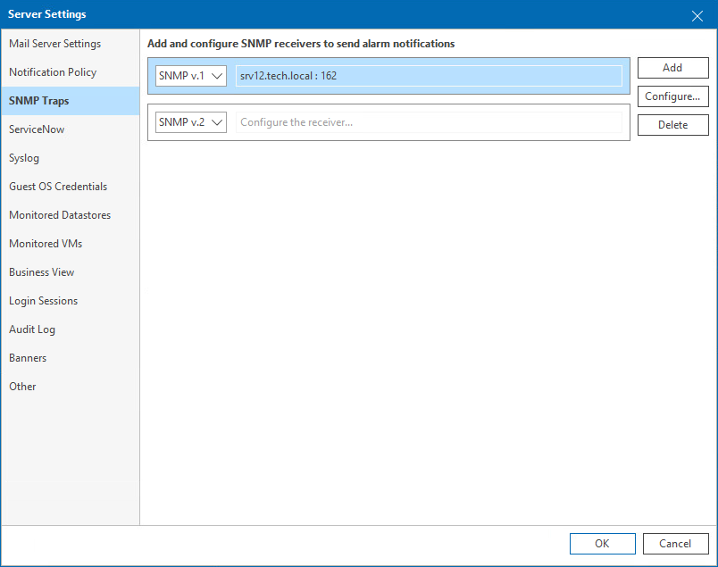

# SNMP Traps

In SNMP settings, you can specify trap notification settings for sending notifications about alarms.

To specify SNMP settings:

1. Open Veeam ONE Client.

For details, see [Accessing Veeam ONE Components](access.md).

1. In the main menu, click Settings > Server Settings.

Alternatively, press [CTRL + S] on the keyboard.

1. In the Server Settings window, open the SNMP Traps tab.
2. Configure SNMP settings for sending trap notifications about alarms.

For details on configuring SNMP notification options, see [Configuring SNMP Traps](snmp_traps.md).

