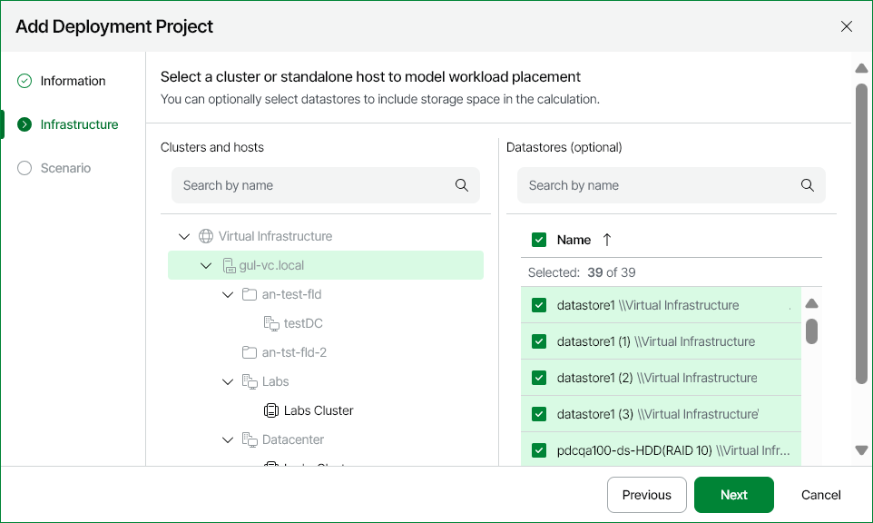

# Step 3. Specify Deployment Infrastructure

At the Infrastructure step of the wizard, select cluster or host on which you want to build deployment project:

1. In the Clusters and hosts hierarchy, select a host or cluster to which you want to add hosts or VMs, or from which you want to remove hosts or VMs.
2. [Optional] In the Datastores list, select one or more datastores to which VMs will be deployed. Select datastores if you need to calculate storage resource requirements for new VMs.

The datastore selection scope includes all datastores accessible by the selected container.

