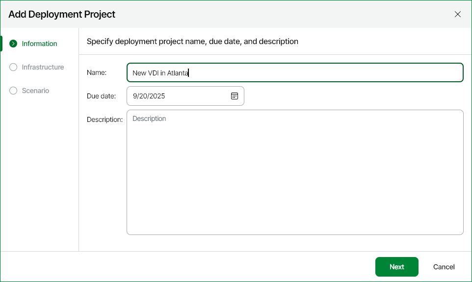

# Step 2. Specify Deployment Project Name and Description

At the Information step of the wizard, specify deployment project name, description and the date when the deployment project must be completed.

