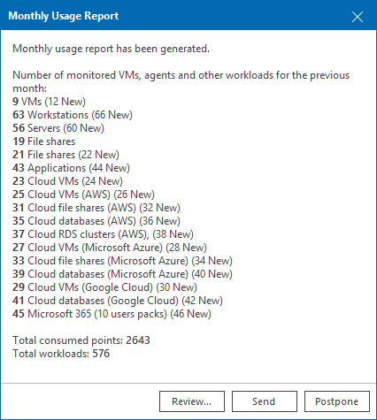
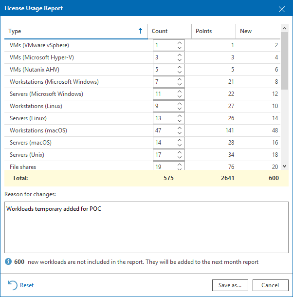

# Submitting License Usage Report

If you use a Rental license, you must submit a license usage report to Veeam every month. The license usage report reflects the maximum number of instances consumed by workloads that you were managing with Veeam ONE within the previous calendar month: VMs, file shares and Veeam Agents (Workstation and Server), cloud instances (cloud VMs, cloud databases and cloud file shares), enterprise applications, object storage and Microsoft 356 users.

There are two methods to submit a license usage report:

* You can submit a license usage report in Veeam ONE Web Client (recommended). For details, see [Submitting License Usage Report in Veeam ONE Web Client](submit_license_usage_report.md#monitor).
* You can submit a license usage report manually by sending an email with a generated report to a Veeam sales representative. For details, see [Submitting Offline License Usage Report](submit_license_usage_report.md#offline).

Submitting License Usage Report in Veeam ONE Web Client

If the Veeam ONE server has access to the internet, you can submit the license usage report to Veeam directly from Veeam ONE Web Client.

This method is available only if license auto update is enabled. For details on automated license update, see [Updating and Renewing License](update_license.md).

License usage reporting is performed in the following way:

1. Veeam ONE collects statistics on the current license usage.
2. On the first day of the new month, Veeam ONE generates a license usage report based on the maximum number of managed objects in the previous month.
3. Veeam ONE notifies you that the report has been generated when you open Veeam ONE Web Client.

1. You can review the report, adjust it and send it to Veeam.

If you do not send and save the report, on the third day of the month, Veeam ONE will save and send the report automatically. You can access the report on the Veeam ONE server, in the %ProgramData%\Veeam\Licensing\Veeam ONE Report folder.

To submit a license usage report in Veeam ONE Web Client:

1. Open Veeam ONE Web Client.

For details, see [Accessing Veeam ONE Components](access.md).

1. At the top right corner of the Veeam ONE Web Client window, click Configuration.
2. In the configuration menu on the left, click License Information.
3. On the License tab, click Create Report.
4. In the Monthly Usage Report dialog, review the reported workloads. To change a count, click Edit, specify the new value and click Save. If you change the reported counts, specify a reason in the Reason for changes field.
5. Click Send.

Veeam ONE submits the report to Veeam.

Submitting Offline License Usage Report

If the Veeam ONE server does not have access to the internet, you can save the license usage report in Veeam ONE Web Client and send it to Veeam manually.

You can save the report as a PDF file and send it to your Veeam sales representative.

This method is available only if license auto update is disabled. For details, see [Updating and Renewing License](update_license.md).

To submit an offline license usage report:

1. Open Veeam ONE Web Client.

For details, see [Accessing Veeam ONE Components](access.md).

1. At the top right corner of the Veeam ONE Web Client window, click Configuration.
2. In the configuration menu on the left, click License Information.
3. On the License tab, click Create Report.
4. In the Monthly Usage Report dialog, review the reported workloads and adjust the counts if necessary.
5. Click Save to download the report.
6. Send the report to your Veeam sales representative.

Related Topics

[License Usage Statistics](automatic_usage_logging.md)

Page updated 2026-07-24

