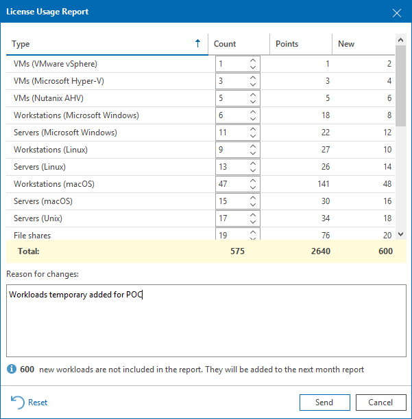

# Submitting License Usage Report

If you use a Rental license, you must submit a license usage report to Veeam every month. The license usage report reflects the maximum number of instances consumed by workloads that you were managing with Veeam ONE within the previous calendar month: VMs, file shares and Veeam Agents (Workstation and Server), cloud instances (cloud VMs, cloud databases and cloud file shares), enterprise applications, object storage and Microsoft 356 users.

There are two methods to submit a license usage report:

* You can submit a license usage report in Veeam ONE Client (recommended). For details, see [Submitting License Usage Report in Veeam ONE Client](submit_license_usage_report.md#monitor).
* You can submit a license usage report manually by sending an email with a generated report to a Veeam sales representative. For details, see [Submitting Offline License Usage Report](submit_license_usage_report.md#offline).

Submitting License Usage Report in Veeam ONE Client

If Veeam ONE server has access to Internet, you can submit a license usage report in Veeam ONE Client. When you submit a license usage report in Veeam ONE Client, Veeam ONE sends license usage statistics to the Veeam License Update Server.

This method is available only if license auto update is enabled. For details on automated license update, see [Updating License](update_license.md#auto).

License usage reporting is performed in the following way:

1. Veeam ONE collects statistics on the current license usage.
2. On the first day of the new month, Veeam ONE generates a license usage report based on the maximum number of managed objects in the previous month.
3. Veeam ONE informs you about the generated report with a notification window in Veeam ONE Client each time you access the console.

1. You can review the report, adjust it and send it to Veeam.

If you do not send and save the report, on the third day of the month, Veeam ONE will save and send the report automatically. You can access the report on the Veeam ONE server, in the %ProgramData%\Veeam\Licensing\Veeam ONE Report folder.

To submit a license usage report in Veeam ONE Client:

1. Open Veeam ONE Client.

For details, see [Accessing Veeam ONE Components](access.md).

1. In the main menu, click License.
2. In the License Information window, click Create Report.
3. In the License Usage Report window, you can adjust the number of managed workloads before you submit the report.
4. If you have reduced the number of workloads, the Reason for changes field, specify a reason for reducing report statistics or any additional information.
5. Click Send.

Veeam ONE will display a dialog box with the submission result.

1. Click OK to acknowledge the result and close the dialog box.

Submitting Offline License Usage Report

If Veeam ONE server does not have access to Internet or has connection problems, you can submit an offline license usage report. When you submit an offline license usage report, Veeam ONE generates a file with license usage statistics.

The report file can be generated in the JSON, PDF or XLS format. You must send a report in the JSON format to Veeam. You can save the report in the PDF or XLS formats for your own needs.

This method is available only if license auto update is disabled. For details, see [Updating License](update_license.md#auto).

To submit an offline license usage report:

1. Open Veeam ONE Client.

For details, see [Accessing Veeam ONE Components](access.md).

1. In the main menu, click License.
2. In the License Information window, click Create Report.
3. In the License Usage Report window, you can adjust the number of managed workloads before you submit the report.
4. If you have reduced the number of workloads, the Reason for changes field, specify a reason for reducing report statistics or any additional information.
5. Click Save as and choose a folder to which you want to save the report.
6. When the report is generated, Veeam ONE will display a dialog box notifying that the report was created. In the dialog box, click Open folder to navigate to the folder where the report resides.
7. Review the report and send it to a Veeam sales representative.

Related Topics

[License Usage Statistics](automatic_usage_logging.md)

