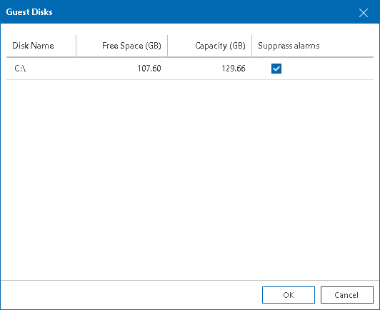

# Suppressing Guest Disk Space Alarms

You can suppress Guest disk space alarms for specific VM guest OS disks:

1. Open Veeam ONE Client.

For details, see [Accessing Veeam ONE Components](access.md).

1. At the bottom of the inventory pane, click the necessary view (Virtual Infrastructure, Business View).
2. In the inventory pane, select the necessary VM.
3. In the information pane, open the Summary tab.
4. In the Guest Disk Usage section, click the View all disks link.
5. In the Guest disks list, select check boxes next to guest OS disks for which alarms must be suppressed.
6. Click OK.

