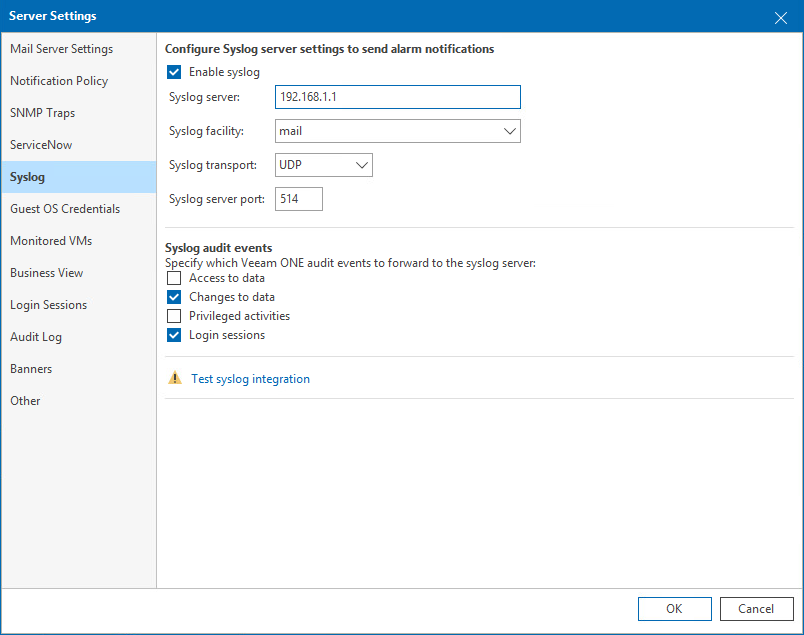

# Syslog Integration

Syslog integration allows you to send pre-built Veeam ONE alarms and data for audit events for reuse within your Syslog server environment.

At the Syslog step of the wizard, specify your Syslog settings used to return alarms to your Syslog instance.

To specify your Syslog integration details:

1. Click the Enable syslog check box.
2. Enter Syslog server details:

* Syslog server — define the IPv4 or IPv6 address of your Syslog instance.
* Syslog facility — define the value used to identify the source of the alarm. By default this is set to mail.
* Syslog transport — define TCP, TCP with TLS, or UDP. By default this is UDP.
* Syslog server port — the port used to connect to your Syslog integration instance. By default this is 514.

1. Select your required Syslog Audit events to send to your Syslog integration:

* Access to data
* Changes to data
* Privileged activities
* Login sessions

1. To test the connection settings, click Test syslog integration. This creates a test connection to Syslog and returns a signal confirming a successful connection.

If you select the Enable syslog check box and do not test the connection, Veeam ONE will verify it before saving the server settings. Additionally, the connection is checked when each Server Settings item (Mail Server Settings, Email Notifications and so on) changes.

For details on Syslog alarm server settings, see [Configuring Alarm Notifications](configure_alarm_notification.md).

