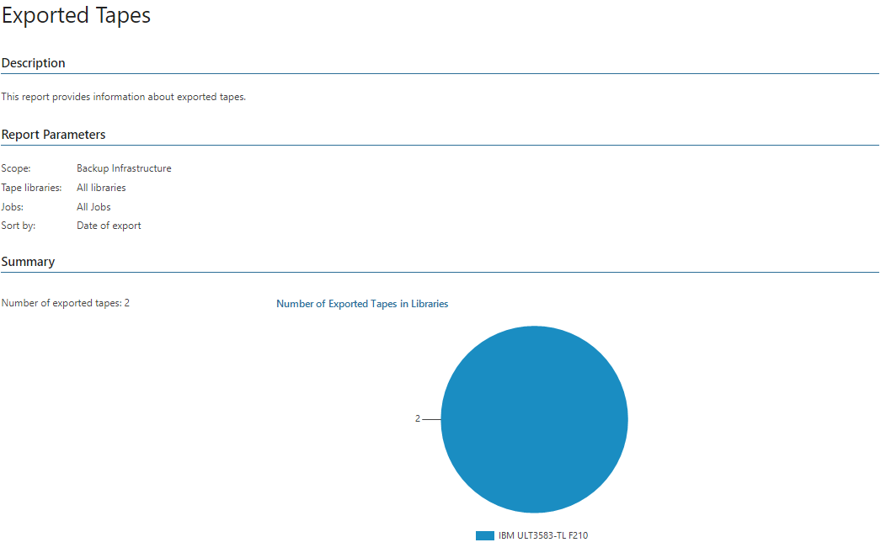

# Exported Tapes

The report provides inventory information on tapes exported from tape libraries connected to Veeam Backup & Replication servers.

* The Summary section shows the total number of exported tapes.
* The Number of Exported Tapes in Libraries chart displays how many tapes were exported from connected libraries.
* The Details table provides information on each tape library, including a list of all exported tapes, their IDs, media sets and media pools, backup job and exportation date and time.

Report Parameters

You can specify the following report parameters:

* Infrastructure objects: defines a list of Veeam Backup & Replication servers to include in the report.
* Tape libraries: defines tape libraries to include in the report.
* Jobs: defines a list of tape jobs to analyze in the report.

Use Case

The report allows you to trace tapes exported from tape libraries. You can use this report to find the necessary backup files on tape.

