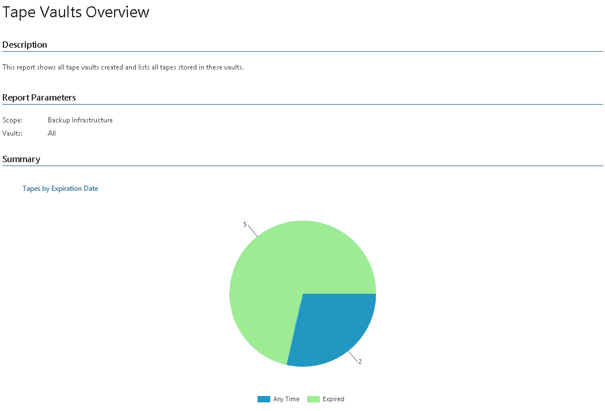
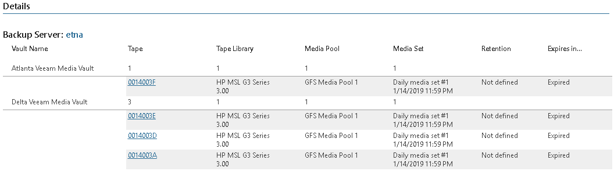

# Tape Vaults Overview

This report provides information on tape vaults created in Veeam Backup & Replication, lists all tapes archived in these vaults and previous tape location.

* The Summary section includes the Tapes By Expiration Date chart that shows how soon data in tape vaults will expire and how many tapes will expire within the specified period.

* The Report Data section provides the Details and Tape Vaults Overview tables detailing information on the Veeam Backup & Replication server where the vault was created, stored offline tapes, previous location of each tape and how soon media sets will expire.

Report Parameters

You can specify the following report parameters:

* Infrastructure objects: defines a list of Veeam Backup & Replication servers to include in the report.
* Vaults: defines a list of vaults to include in the report.

Use Case

This report allows you to track offline tapes stored in vaults that were created by Veeam Backup & Replication servers. Since vaults keep information about original location of tapes, such as library and media pool, data written to tapes and retention policy, you can also use the information provided in the report to facilitate offline tape management and track VMs and computers stored on these tapes.

