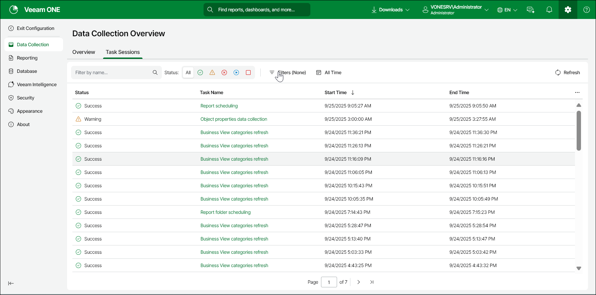

# Task Sessions

Task sessions provide a detailed record of ongoing and completed operations within the system, enabling effective monitoring and management of various tasks.

To view Task Sessions:

1. Open Veeam ONE Web Client.

For details on accessing Veeam ONE components, see [Veeam ONE Web Client](access.md#access_web_client).

1. In the configuration menu, click Data Collection.
2. Click Task Sessions.
3. Click the required session from the Task Name list.

To easily find the necessary session, you can apply the following filters:

* Filter by name — search the list of sessions by name.
* Status — limit the list of sessions by status (Success, Warning, Failed, Processing, Stopped).
* Filter — filter the list of sessions by session type including:

* Object properties data collection

* Business view categories refresh
* Database maintenance
* Report scheduling
* Dashboard scheduling
* Report folder scheduling
* Deployment projects calculation

* Time period — limit the list of sessions by a defined time period.

Related Topics

* [Viewing Data Collection Session Details](view_collection_details.md)
* [Business View](bv.md)
* [Scheduling Reports](schedule_dashboards.md)
* [Scheduling Dashboards](schedule_dashboards.md)
* [Scheduling Delivery for Multiple Reports](schedule_multiple_reports.md)
* [Calculating Deployment Projects](build_deployment_projects.md)

