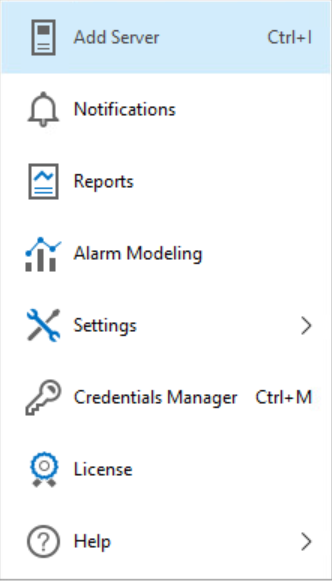

# Toolbar and Main Menu

Toolbar

Veeam ONE Client toolbar provides access to frequently used commands.

* Back/Forward — navigate to the previous/next visited view in the Veeam ONE Client.
* Refresh — retrieve the latest collected data from the Veeam ONE Monitoring Service to show up-to-date information in the Veeam ONE Client. To perform this command, you can also press [F5] on the keyboard.
* Full Screen — switch to the full screen mode. To perform this command, you can also press [F11] on the keyboard.
* Get Full Version (present in Community Edition Mode or if the current license is outdated) — access the webpage where you can download Veeam free trial that allows you to use Veeam ONE with no functionality restrictions for a limited period of time.

Main Menu

Veeam ONE Client main menu provides access to the following commands and features:

* Add Server — connect a new virtualization server, VMware Cloud Director, or Veeam Backup & Replication server. To perform this command, you can also press [CTRL+I] on the keyboard.

For details on connecting servers, see [Adding Data Source](connecting_servers.md).

* Notifications — open the Notification Settings wizard.

For details on configuring notifications, see [Configuring Notification Settings](configure_notification_settings.md).

* Reports — create a report for an infrastructure object selected in the inventory pane.

For details on creating reports, see [Viewing Reports](view_reports.md).

* Alarm Modeling — forecast the number of alarms that will be triggered for an infrastructure object selected in the inventory pane.

For details on alarm modeling, see [Modeling Alarm Number](model_alarms.md).

* Settings — view or change Veeam ONE client and server settings.

For details on customizing settings, see [Configuring Veeam ONE](configure_veeam_one.md).

* Credentials Manager — view and manage credentials records.

For details on working with credentials, see [Security](credentials_manager.md).

* License — view license information, change and update the license file, and send license usage reports.

For details on Veeam ONE licensing, see [Licensing Veeam ONE](licensing.md).

* Help — open Veeam ONE Client help, export log files and check the current version of Veeam ONE Client. To open help topics, you can also press [F1] on the keyboard.

Page updated 2026-08-03

