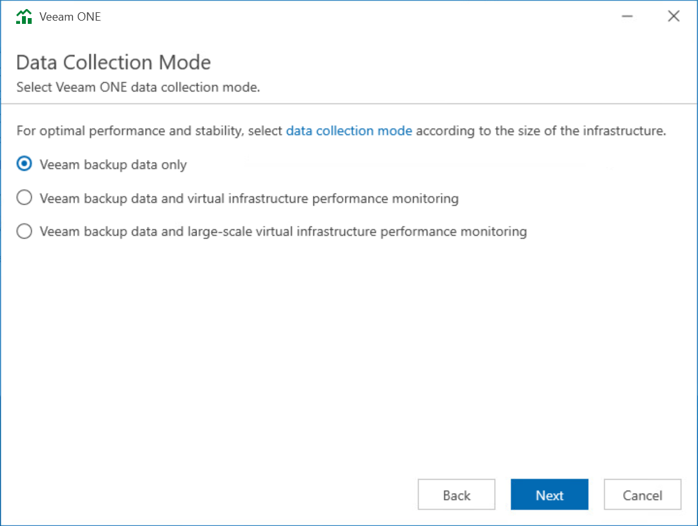

# Step 12. Choose Data Collection Mode

At the Data Collection Mode step of the wizard, choose the mode in which Veeam ONE will collect data from virtualization and Veeam Backup & Replication servers.

Data collection mode determines what metrics Veeam ONE will collect, and specifies the product configuration in a number of areas. Choosing an appropriate data collection mode allows you to optimize monitoring and reporting performance and improve user experience in Veeam ONE. To learn the difference between the data collection modes, see [Data Collection Modes](data_collection_modes.md).

Veeam Backup Data Only

The Veeam backup data only mode is recommended for users who want to focus on Veeam Backup & Replication and Veeam Backup for Microsoft 365 monitoring and reporting, and do not need a deep visibility of the virtual infrastructure.

In this mode, Veeam ONE does not collect performance metrics from separately added (external) Veeam Backup & Replication infrastructure components — backup proxies and backup repositories deployed on their own hosts (including hardened/appliance Linux hosts such as JeOS-based ones). Performance metrics of the proxy and repository roles running on the Veeam Backup & Replication server itself are still collected.

This mode, Veeam ONE collects all inventory, configuration and performance metrics from Veeam Backup & Replication and Veeam Backup for Microsoft 365 servers. It also collects inventory and configuration metrics from virtualization servers, but skips virtual infrastructure performance metrics. As a result, Veeam ONE dashboards, reports and alarms display backup-related data only. For VMware vSphere and Microsoft Hyper-V objects, performance data is not available.

This mode results in the least possible size of the Veeam ONE database and the lowest load on the Veeam ONE server.

Veeam Backup Data and Virtual Infrastructure Performance Monitoring

The Veeam backup data and virtual infrastructure performance monitoring modes are recommended for users who want to monitor and report on the virtual environment, Veeam Backup & Replication and Veeam Backup for Microsoft 365 infrastructures.

* Veeam backup data and virtual infrastructure performance monitoring mode is recommended for small to medium environments up to 100 hosts and 1500 VMs. In this mode, Veeam ONE collects all inventory, configuration and performance metrics, and makes collected data available in dashboards, reports and alarms.

This mode provides the greatest data granularity level, but results in a greater load on the Veeam ONE server and a larger size of Veeam ONE database.

* Veeam backup data and large-scale virtual infrastructure performance monitoring mode is recommended for large environments with more than 100 hosts and 1500 VMs. In this mode, Veeam ONE collects all metrics required for alarms and reports.

In this mode, Veeam ONE does not collect performance metrics from separately added (external) Veeam Backup & Replication infrastructure components (backup proxies and backup repositories deployed on their own hosts, including hardened/appliance Linux hosts). Performance metrics of the proxy and repository roles running on the Veeam Backup & Replication server itself are still collected.

This mode results in a lower load on the Veeam ONE server and a smaller size of the Veeam ONE database.

|  |
| --- |
| Note |
| Collection of performance metrics from separately added (external) Veeam Backup & Replication infrastructure components — backup proxies and backup repositories deployed on their own hosts (including hardened/appliance Linux hosts such as JeOS-based ones) — depends on the selected data collection mode. Performance metrics of the proxy and repository roles running on the Veeam Backup & Replication server itself are collected in all modes.   * Veeam backup data and virtual infrastructure performance monitoring — metrics from the external components are collected. * Veeam backup data and large-scale virtual infrastructure performance monitoring — metrics from the external components are not collected. * Veeam backup data only — metrics from the external components are not collected. |

Page updated 2026-07-22

