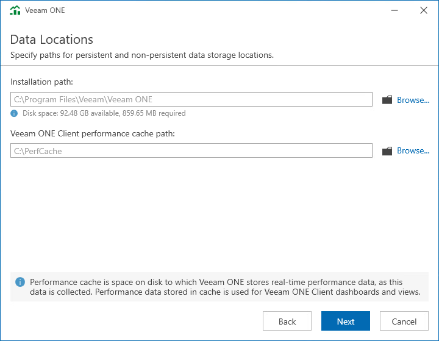

# Step 11. Choose Data Locations

In the Installation path, choose the installation directory. In the typical installation mode, the setup installs all components to a single directory and creates a subdirectory for every Veeam ONE component.

In the Veeam ONE Client performance cache path, choose a directory where the performance cache must be located.

Performance cache is space on disk to which Veeam ONE stores real-time performance data, as this data is collected. Performance data stored in cache is used for Veeam ONE Client dashboards and views. Disk-based performance cache allows significantly decrease RAM utilization on the machine that runs the Veeam ONE Server component.

By default, the performance cache is stored to the C:\PerfCache folder. To store the cache to a different folder, click Browse next to the Path field and specify a path to the new folder.

When choosing a location for performance cache, consider the following recommendations:

* Make sure that the disk where the performance cache is located can quickly complete read and write requests. Do not locate the cache remotely in networks with high latency values.
* For large monitoring environments, place the performance cache on an SSD local to the machine where the Veeam ONE Server component runs. For small and medium monitoring environments, a HDD is normally enough.
* Length of the performance cache folder path must not exceed the Windows Max Path Limitation value. For details, see [Microsoft Learn](https://learn.microsoft.com/en-us/windows/win32/fileio/naming-a-file?redirectedfrom=MSDN).
* Make sure there is enough disk space for performance cache. The cache is cleared on an hourly basis, as new data is collected; however, in large monitoring environments it can take significant disk space. For example, in the custom deployment mode, during peak loads, the cache can take up to 6 GB disk space for each 1000 VMs.

The typical installation requires around 850 MB of free space on a disk (plus additional space if you choose to install Microsoft SQL Server instance on the same machine). Be aware that depending on the size of your virtual infrastructure and frequency of data collection, the database may grow large and require more space. Be sure to adjust to this condition by freeing up more disk space when needed.

Related Topics

* [System Requirements](system_requirements.md)
* [Data Retention](data_retention.md)

