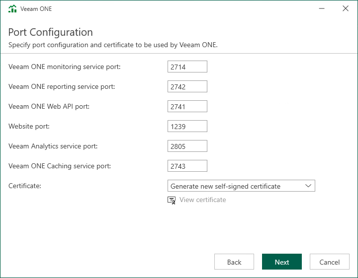

# Step 13. Specify Connection Ports

At the Port Configuration step of the wizard, specify connection settings for Veeam ONE components, Veeam ONE Web API and Veeam Analytics service:

* In the Veeam ONE monitoring service port field, type a number of the port that will be used to interact with Veeam ONE Monitoring service.

The default port number is 2714.

* In the Veeam ONE reporting service port field, type a number of the port that will be used to interact with Veeam ONE Reporting service.

The default port number is 2742.

* In the Veeam ONE Web API port field, type a number of the port that will be used by Veeam ONE Monitoring service and Web Services component to interact with Veeam ONE Reporting service.

The default port number is 2741.

* In the Website port field, type a number of the port that will be used to access the Veeam ONE Web Client through a web browser.

The default port number is 1239.

* In the Veeam Analytics service port field, type a number of the port that Veeam Analytics service will use to collect data from connected Veeam Backup & Replication servers.

The default port number is 2805.

* In the Veeam ONE Caching service port field, type a number of the port that the Veeam ONE Caching service will use to provide cached report data by Veeam ONE Reporting service requests.

The default port number is 2743.

* In the Certificate list, choose a certificate that will be used to secure traffic between the web browser, Veeam ONE Web Services and Veeam ONE Reporting service.

You can choose an existing certificate installed on the machine. If the setup wizard does not find an appropriate certificate to be used, it generates a self-signed certificate.

|  |
| --- |
| Note: |
| * If you generate or choose a self-signed certificate, you must configure a trusted connection between the Veeam ONE Web Client website and a web browser later. For details, see [Configuring Trusted Connection](access.md#configure_trusted). * You can change the selected certificate after installation. For details on changing Veeam ONE Web Client website certificate, see [Change Default Certificate](upgrade_change_certificate.md). For details on changing Veeam ONE Reporting service certificate, see [Veeam ONE Server Settings](utility_monitor.md). |

