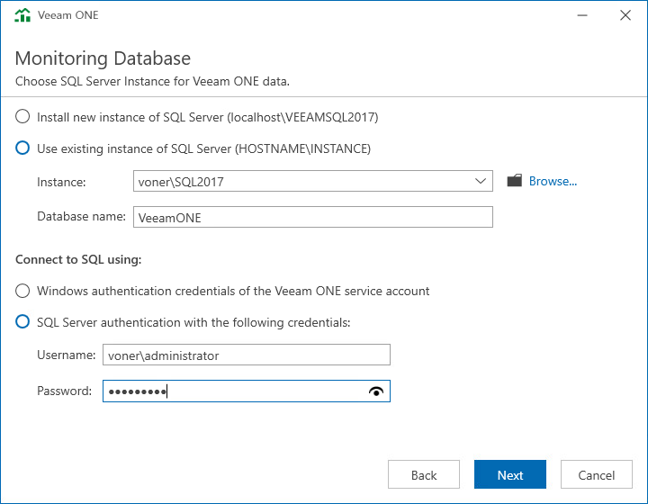

# Step 9. Choose Monitoring Database

At the Monitoring Database step of the wizard, choose a Microsoft SQL Server instance that will host the Veeam ONE database.

* If you do not have a Microsoft SQL Server instance that you can use for Veeam ONE database, select the Install new instance of SQL Server option.

If this option is selected, the setup will install Microsoft SQL Server 2017 Express locally, on the computer where you are installing Veeam ONE.

|  |
| --- |
| Note: |
| * If a Microsoft SQL Server instance that meets Veeam ONE system requirements is detected on the machine, you can only use the existing local Microsoft SQL Server instance or choose a one that runs remotely. The option to install a new Microsoft SQL instance will be unavailable in this case. * If you choose to host Veeam ONE database on Microsoft SQL Server Express, consider is a 10 GB database size limitation for this edition. For details, see [Editions and Supported Features for SQL Server](https://learn.microsoft.com/en-us/sql/sql-server/editions-and-components-of-sql-server-2016?redirectedfrom=MSDN&view=sql-server-ver16). |

* If you want to use an existing local or remote Microsoft SQL Server instance, select the Use existing instance of SQL Server option and choose a local Microsoft SQL Server instance or browse to a Microsoft SQL Server instance running remotely. You can enter the address of a preferred Microsoft SQL Server manually or use the Browse button to choose among available remote instances.

In the Database name field, specify the name of the database that will be created by Veeam ONE. Provide credentials for the account that will be used by Veeam ONE components to access the database. You can enter credentials explicitly or use Windows authentication credentials of the Veeam ONE service account to connect to the Microsoft SQL Server. For details on required permissions for the account, see [Connection to Microsoft SQL Server](connection_to_sql.md).

* If you already have an existing Veeam ONE database that you want to use in your deployment, select the Use existing instance of SQL Server option and choose a Microsoft SQL Server instance that hosts the database. This can be a database that you have previously [created with a SQL script](create_database_with_sql_script.md). In the Database name field, specify the name of the database.

Provide credentials for the account that will be used by Veeam ONE components to access the database. You can enter credentials explicitly or use Windows authentication credentials of the Veeam ONE service account to connect to the Microsoft SQL Server. For details on required permissions for the account, see [Connection to Microsoft SQL Server](connection_to_sql.md).

