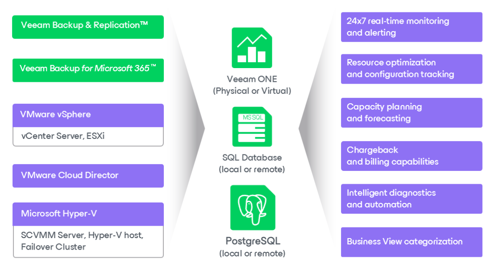

# All-in-One Deployment

The following diagram illustrates the all-in-one Veeam ONE deployment scenario.

In the all-in-one deployment scenario:

* All Veeam ONE architectural components (Veeam ONE Server, Veeam ONE Web Services, Veeam ONE and Veeam ONE agent server) are installed altogether on a single machine (either physical or virtual).
* To store data retrieved from connected servers, a local or remote Microsoft SQL Server instance is required. If you have a Microsoft SQL Server instance that meets Veeam ONE system requirements, you can adopt it for Veeam ONE deployment. Otherwise, you can install a new Microsoft SQL Server instance during the product installation — Veeam ONE setup package includes Microsoft SQL Server 2017 Express Edition.

|  |
| --- |
| Note: |
| * For production deployments, it is recommended to use a remote Microsoft SQL Server installation. It is also recommended to run Veeam ONE services on a dedicated server. Such distributed installation will improve performance of Veeam ONE services. * If you choose to host Veeam ONE database on Microsoft SQL Server Express, consider is a 10 GB database size limitation for this edition. For details, see [Editions and Supported Features for SQL Server](https://learn.microsoft.com/en-us/sql/sql-server/editions-and-components-of-sql-server-2016?redirectedfrom=MSDN&view=sql-server-ver16). |

* To enable multi-user access to real-time performance statistics and configurable alarms, you can additionally install one or more instances of Veeam ONE Client on separate machines. Thus, you will be able to access Veeam ONE functionality either from a local machine or from remote computers.

For instructions on the all-in-one deployment procedure, see [All-in-One Installation](typical_installation.md).

