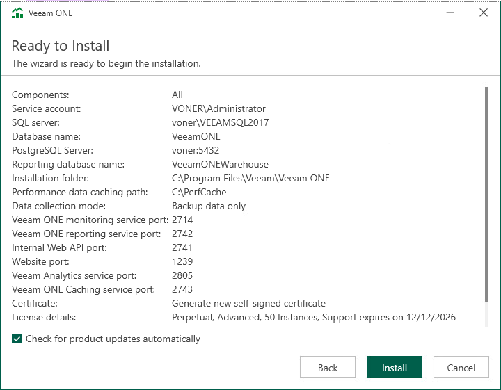

# Step 14. Review Installation Summary

At the Ready to Install step of the wizard, review installation configuration to ensure that you have provided correct settings.

Select the Check for product updates automatically check box if you want Veeam ONE to automatically check and download available updates.

Click Install to begin the installation.

