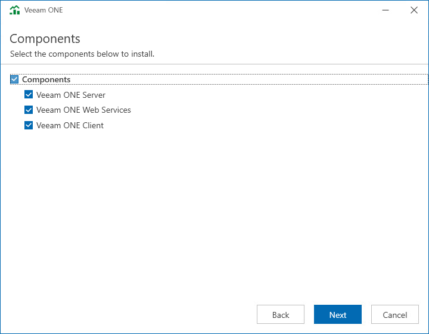

# Step 8. Select Architectural Components

For an All-in-One installation, select the Components check box to install all components:

* Veeam ONE Server

* Veeam ONE Web Services

* Veeam ONE Client

