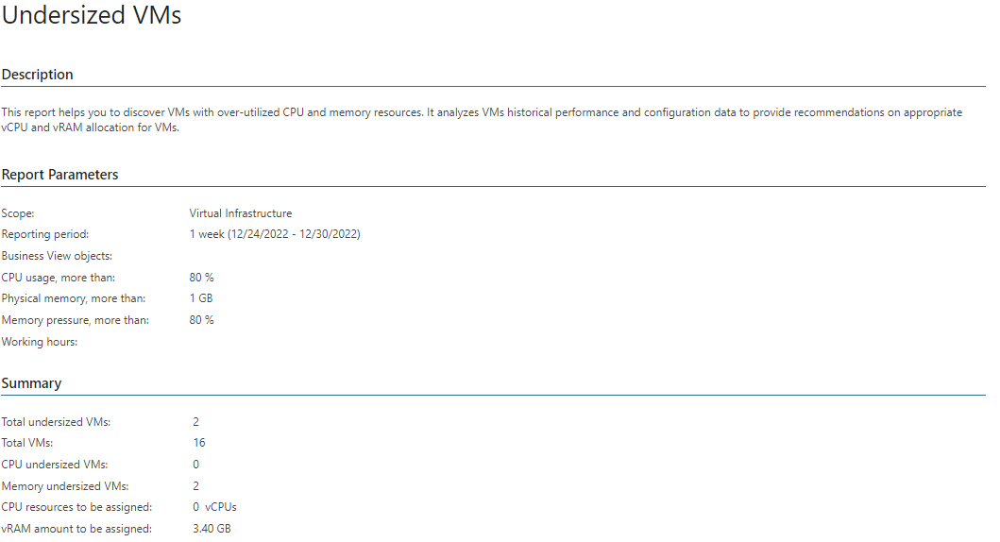

# Undersized VMs (Hyper-V)

This report allows you to identify VMs that have less allocated resources such as vRAM or vCPU than they require.

* The Summary section provides an overview of the current state of your infrastructure, including the total number of VMs and the number of CPU and memory undersized VMs, and shows recommendations on resource allocation.

* The Undersized Virtual Machines by CPU and Undersized Virtual Machines by Memory tables display VMs with insufficient CPU and memory resources and deliver recommendations for their reconfiguration.

Click a VM name in the Virtual Machine column to drill down to VM performance charts that show how CPU and memory usage has been changing within the reporting period.

Report Parameters

You can specify the following report parameters:

* Infrastructure objects: defines a virtual infrastructure level and its sub-components to analyze in the report.
* Business View objects: defines Business View groups to analyze in the report. The parameter options are limited to objects of the Virtual Machine type.

Business View groups from the same category are joined using Boolean OR operator, Business View groups from different categories are joined using Boolean AND operator. That is, if you select groups from the same category, the report will contain all objects that are included in groups. However, if you select groups from different categories, the report will contain only objects that are included in all selected groups.

* Period: defines the time period to analyze in the report. Note that the reporting period must include at least one successfully completed Object properties data collection task for the selected scope. Otherwise, the report will contain no data.
* Business hours from - to: defines time of a day for which historical performance data will be used to calculate the performance trend. All data beyond this interval will be excluded from the baseline used for data analysis.
* CPU usage, more than: defines the CPU utilization threshold in percent. If the CPU usage value for a VM exceeds the specified threshold, the VM will be included in the report.

* Memory pressure, more than: defines the dynamic memory pressure threshold in percent. If the memory pressure value for a VM exceeds the specified threshold, the VM will be included in the report.
* Physical memory, more than: defines the threshold for the amount of physical memory assigned to a VM. If the physical memory amount exceeds the specified threshold, this VM will be analyzed in the report.

|  |
| --- |
| Note: |
| Veeam ONE Web Client checks whether the CPU ready and CPU Usage conditions are true at the same, and then whether Swap out rate and Memory Usage conditions are true at the same time (in other words, the conditions in each pair are joined by Boolean “AND”).  Veeam ONE Web Client checks whether a pair of these conditions is true, in other words, pairs of these conditions are joined by Boolean “OR”. |

Use Case

This report uses the specified parameters to identify VMs with insufficient CPU and memory resources. The report delivers detailed information on detected VMs and suggests recommendations for better resource allocation. You may consider adding the specified amount of resources for the VM, relocating the VM to a more powerful host, or adding more resources for undersized VM.

