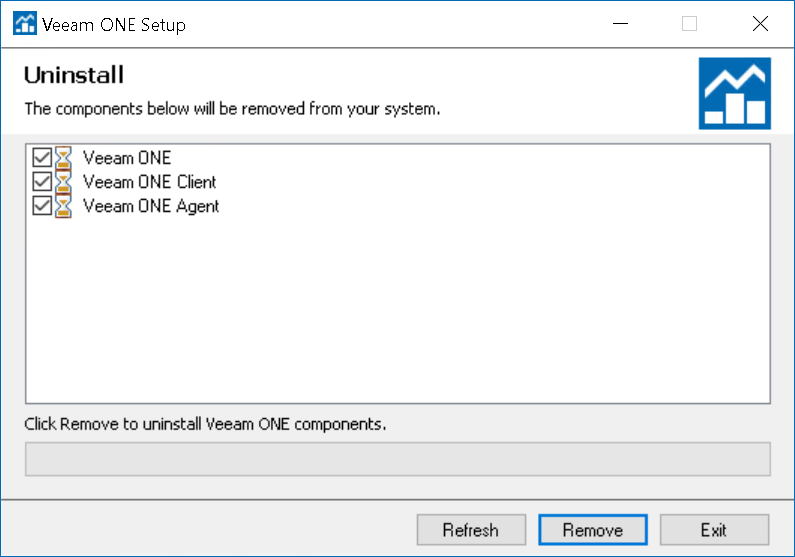

# Uninstalling Veeam ONE

To uninstall Veeam ONE, open the Start menu, go to Control Panel > Uninstall a program, choose Veeam ONE components you want to uninstall and click Remove.

If you installed Veeam ONE using the custom installation, repeat this procedure on every machine where the Veeam ONE components are installed.

The SQL Server instance installed and used by Veeam ONE is not removed during the uninstall of Veeam ONE. It needs to be removed separately using the standard Add or Remove Programs feature in Control Panel. Veeam ONE database and its data is retained until you manually remove the database or uninstall the SQL Server instance.

