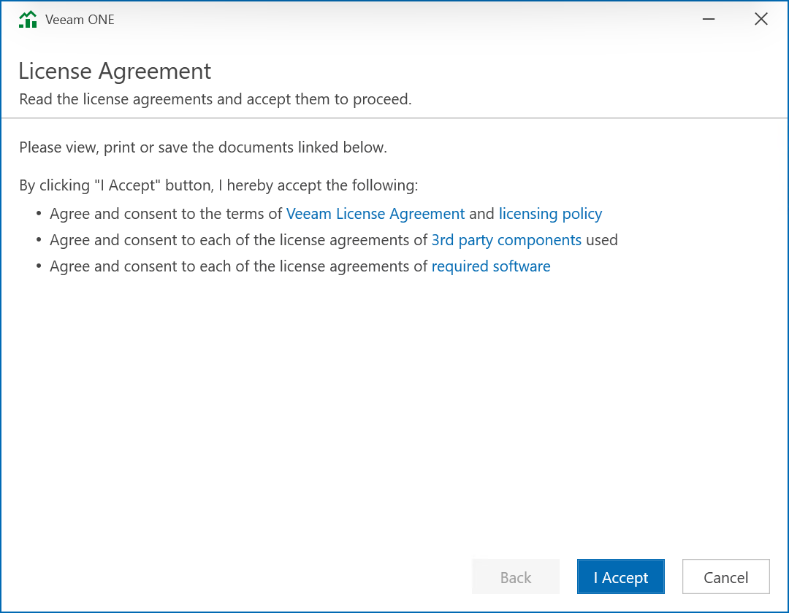

# Step 3. Accept License Agreements

At the License Agreements step of the wizard, read and accept Veeam license agreement, licensing policy, 3rd party components and required software license agreements. You will not be able to continue upgrade until you accept license agreements.

To read the terms of the license agreements, click the individual links.

Page updated 2026-07-07

