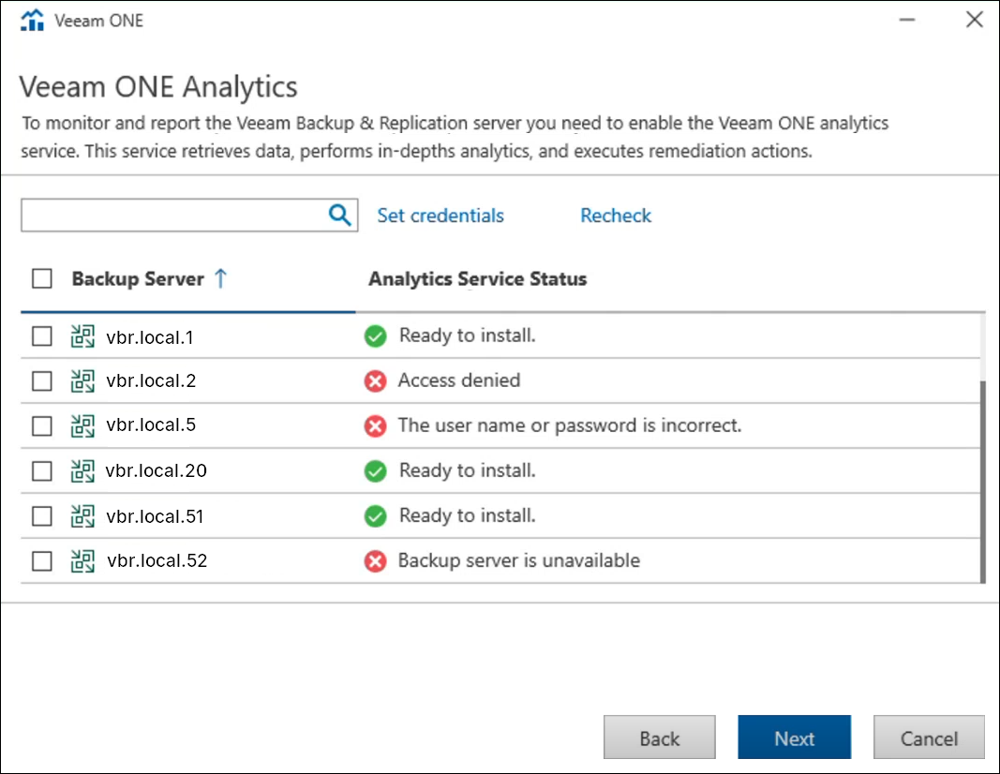

# Step 10. Upgrade Analytics Service Agents

At the Veeam ONE Analytics step, the install wizard checks for your connected Veeam Backup & Replication servers and returns the statues of each Veeam Backup & Replication Server's Veeam Analytics service agent.

If any individual server requires credentials to access that instance, click Set credentials, enter the credentials and click Recheck to perform the server agent check again.

Page updated 2026-07-13

