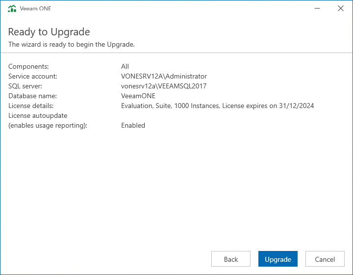

# Step 11. Begin Upgrade

At the Ready to Upgrade step of the wizard, click Upgrade to begin the upgrade process.

If you installed Veeam ONE using the custom installation, repeat this upgrade procedure on every machine where the Veeam ONE components are installed.

Depending on the size of the Veeam ONE database, the upgrade procedure may take up to several hours.

