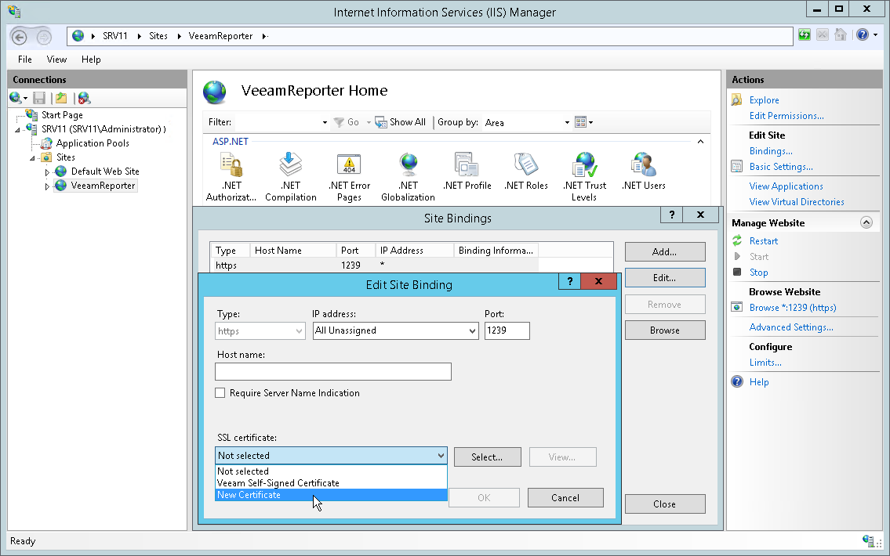

# Step 12. Change Default Certificate

Veeam ONE uses TLS to ensure secure data communication between Veeam ONE Web Client and a web browser. That is, the Veeam ONE Web Client is available over HTTPS.

During upgrade, Veeam ONE generates a self-signed certificate that is used to secure traffic. You can replace this default certificate with your own self-signed certificate or a certificate that was obtained from a Certificate Authority. This step is optional, and is not required if you want to keep the default certificate generated during the upgrade procedure.

For details on Veeam ONE certificates, see [Veeam ONE Certificates](certs_internal_ca.md).

|  |
| --- |
| Note: |
| If you replace the default certificate with another self-signed certificate, you must configure a trusted connection between the Veeam ONE Web Client and a web browser later. For details, see [Configuring Trusted Connection](access.md#configure_trusted). |

Assigning Certificate to the Veeam ONE Web Client Website

To assign a new certificate to the Veeam ONE Web Client:

1. Log on to the machine where the Veeam ONE Web Service component is installed.
2. Open the Internet Information Services (IIS) Manager, expand the localhost node and navigate to Sites.
3. In the Connections pane, select VeeamReporter.
4. In the Actions > Edit Site pane on the right, click Bindings.
5. In the Site Bindings window, select the existing binding and click Edit.
6. From the SSL certificate list, select the necessary certificate and click OK.
7. In the Site Bindings window, click Close.

