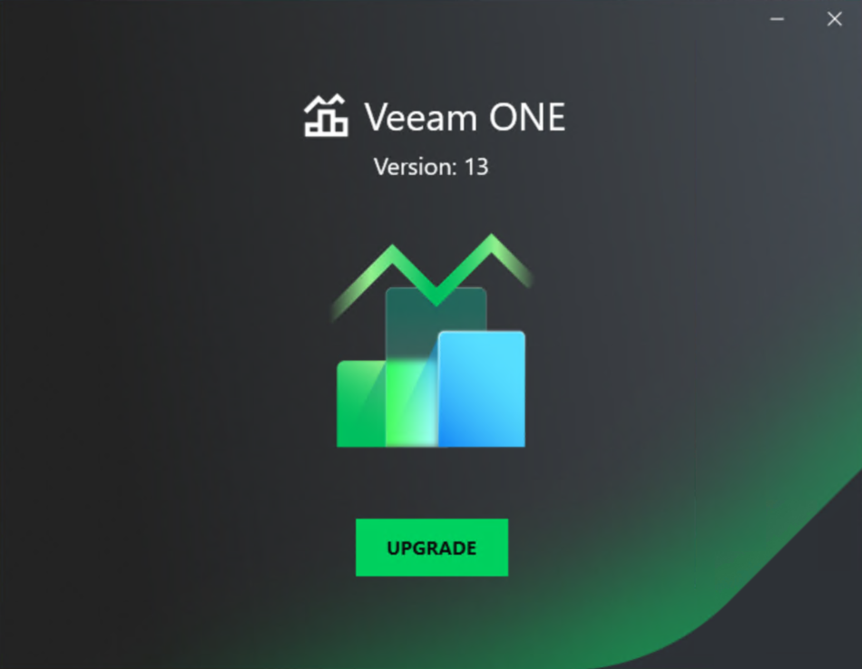

# Step 1. Launch Splash Window

After you mount or insert the disk with Veeam ONE installation image, Autorun will open a splash screen with installation options. On the splash window click Upgrade.

If Autorun is not available or disabled, run the Setup.exe file from the installation image or disk.

