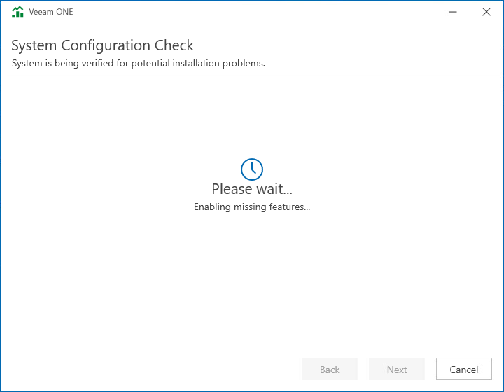

# Step 7. Perform System Configuration Check

At the System Configuration Check step of the wizard, check what prerequisite software is missing.

Before proceeding with the upgrade, the installer will perform system configuration check to determine if all prerequisite software is available on the machine. To learn what software is required for Veeam ONE, see [System Requirements](system_requirements.md).

If some of the required software components are missing, the setup wizard will enable the missing software components and features automatically.

