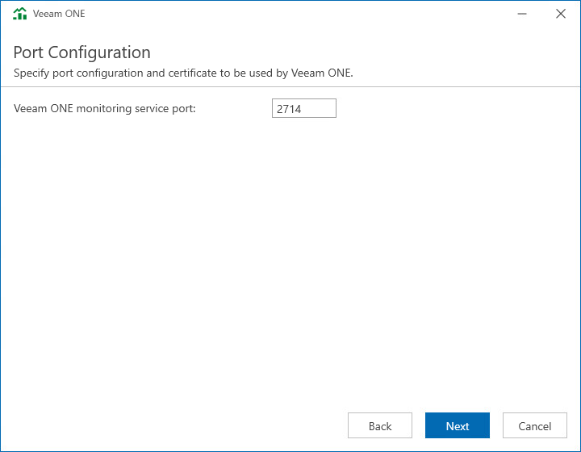

# Step 9. Specify Connection Ports

At the Port Configuration step of the wizard, specify connection settings for Veeam ONE Monitoring Service.

In the Veeam ONE monitoring service port field, type a number of the port that will be used to interact with Veeam ONE Monitoring service.

The default port number is 2714.

