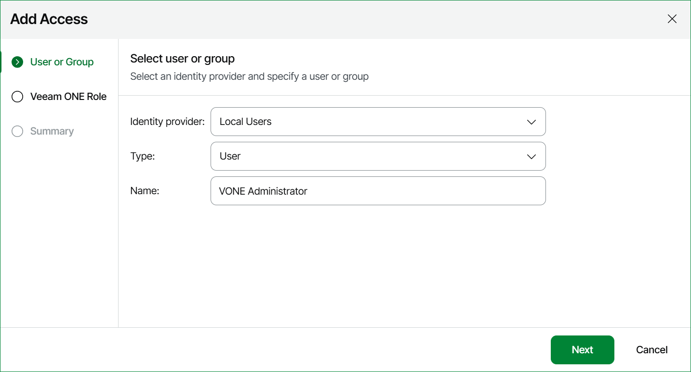
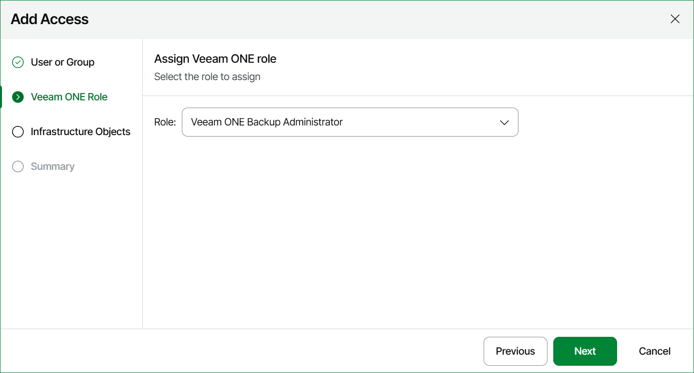
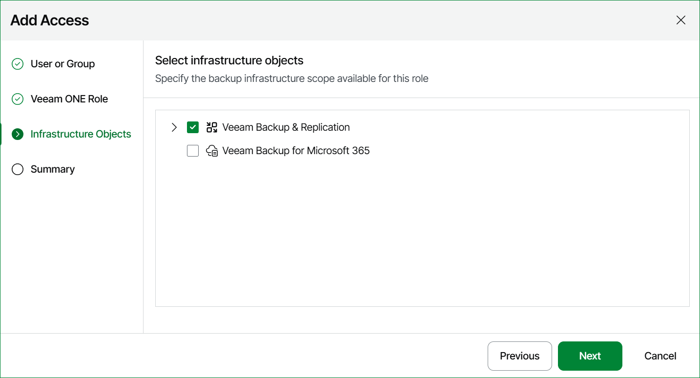
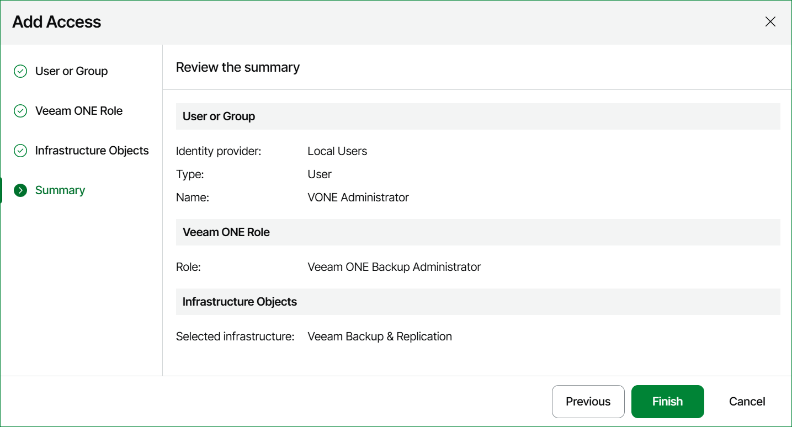
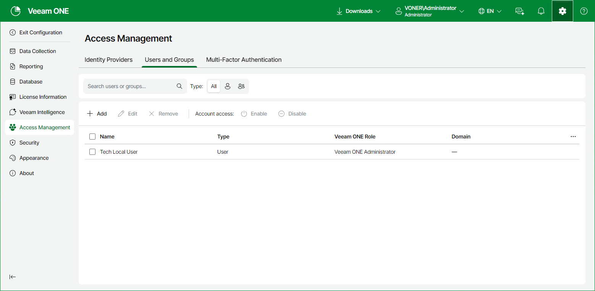

# Managing Users and Groups

On the Users and Groups tab, you can manage Veeam ONE users and groups — assign roles and define the backup infrastructure scope.

Adding Users and Groups

To add a user or group to limit access to Veeam ONE:

1. Open Veeam ONE Web Client.

For details, see [Accessing Veeam ONE Components](access.md).

1. At the top right corner of the Veeam ONE Web Client window, click Configuration.
2. In the configuration menu on the left, click Access Management.
3. On the Users and Groups tab, click Add to open the Add Access wizard.
4. At the User or Group step of the wizard:

* From the Identity provider list, select Local Users or a configured identity provider, such as Microsoft Entra ID, Okta, Keycloak, Microsoft ADFS or Custom.
* From the Type list, select User or Group.
* In the Name section, specify the name for the user or group.

1. At the Veeam ONE Role step of the wizard, select the Veeam ONE user role:

* Veeam ONE Administrator
* Veeam ONE Power User
* Veeam ONE Read-Only
* Veeam ONE Backup Administrator

For details on user roles, see [Security Groups](security_groups.md).

1. [Optional] At the Infrastructure Objects step of the wizard, select the backup infrastructure objects available to the user or group. This step applies only if you selected the Veeam ONE Backup Administrator role.

1. Review the configuration summary and click Finish.

Editing Users and Groups

To edit a user or group:

1. Open Veeam ONE Web Client.

For details, see [Accessing Veeam ONE Components](access.md).

1. At the top right corner of the Veeam ONE Web Client window, click Configuration.
2. In the configuration menu on the left, click Access Management.
3. On the Users and Groups tab, select the user or group you want to edit, and click Edit.

The wizard opens with the settings you specified when adding the user or group. Edit them as required and click Finish.

Removing Users and Groups

If a user or group no longer needs access to Veeam ONE, you can remove its access entry. This revokes the assigned role but does not delete the user or group.

To remove a user or group:

1. Open Veeam ONE Web Client.

For details, see [Accessing Veeam ONE Components](access.md).

1. At the top right corner of the Veeam ONE Web Client window, click Configuration.
2. In the configuration menu on the left, click Access Management.
3. On the Users & Groups tab, select the user or group you want to remove, and click Remove.
4. In the Remove Access window, click Confirm.

Enabling or Disabling Users and Groups

You can disable a user or group to temporarily revoke its access to Veeam ONE without removing the access entry. Disabling keeps the assigned role and settings, so you can enable the user or group again to restore access.

To enable or disable a user or group:

1. Open Veeam ONE Web Client.

For details, see [Accessing Veeam ONE Components](access.md).

1. At the top right corner of the Veeam ONE Web Client window, click Configuration.
2. In the configuration menu on the left, click Access Management.
3. On the Users and Groups tab, select the user or group you want to enable or disable.

To find the necessary user or group, use the search box to search by name or the Type filter to narrow the list by user type.

1. At the top of the user list, click Enable or Disable.
2. In the confirmation window, click Confirm.

Page updated 2026-07-15

