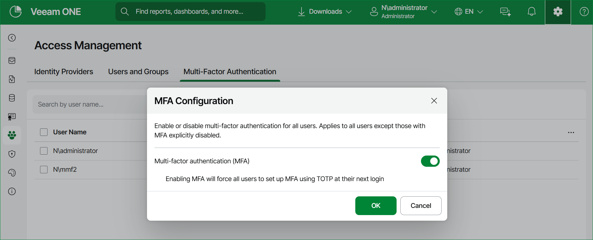

# Configuring Multi-Factor Authentication

Multi-factor authentication (MFA) provides an additional layer of security for Veeam ONE user accounts. When MFA is enabled, users confirm their identity with a one-time password (OTP) generated in a TOTP authenticator application, in addition to their user name and password. On the Multi-Factor Authentication tab of the Access Management section, you can enable or disable MFA for all users, enable or disable MFA for individual users, and reset MFA for a user.

On the Multi-Factor Authentication tab, users are listed with the User Name, Status, and User Role columns. The Status column shows one of the following values:

* Disabled — MFA is turned off for the user.
* Not configured — MFA is enabled for the user, but the user has not set it up yet.
* Configured — the user has set up MFA.

MFA applies when users log in to Veeam ONE through both Veeam ONE Web Client and Veeam ONE Client. For details, see [Accessing Veeam ONE Components](access.md).

|  |
| --- |
| Important |
| MFA does not apply to users authenticated through SAML 2.0 Single Sign-On. SSO users do not appear on the Multi-Factor Authentication tab and bypass MFA at login. Enforce MFA for these users through your identity provider instead. |

Required Permissions

To manage MFA for Veeam ONE users, a user must have the Veeam ONE Administrator role. This includes enabling or disabling MFA globally or for individual users, and resetting MFA. Individual users do not need this role to set up their own MFA: when MFA is enabled for a user, that user is prompted to set it up in an authenticator application at the next login. For details on user roles, see [Security](credentials_manager.md).

Enabling or Disabling MFA for All Users

To enable or disable multi-factor authentication for all Veeam ONE users:

1. Open Veeam ONE Web Client.

For details, see [Accessing Veeam ONE Components](access.md).

1. At the top right corner of the Veeam ONE Web Client window, click Configuration.
2. In the configuration menu on the left, click Access Management.
3. On the Multi-Factor Authentication tab at the top of the user list, click Configuration.
4. In the MFA Configuration window, set the Multi-factor authentication (MFA) toggle to enable or disable MFA for all users.
5. Click OK.

|  |
| --- |
| Note |
| When you enable MFA for all users, each user is prompted to set up MFA in a TOTP authenticator application at the next login. Initial setup is available only in  Veeam ONE Web Client. In Veeam ONE Client, a user who has not yet set up MFA is directed to open Veeam ONE Web Client to complete setup, and then to reconnect. |

Enabling or Disabling MFA for Individual Users

You can enable or disable MFA for an individual user only when MFA is enabled for all users. The per-user status then overrides the global setting — for example, you can disable MFA for a specific user so that this user can log in without MFA. When MFA is disabled for all users, the per-user options are not available.

To enable or disable multi-factor authentication for an individual user:

1. Open Veeam ONE Web Client.

For details, see [Accessing Veeam ONE Components](access.md).

1. At the top right corner of the Veeam ONE Web Client window, click Configuration.
2. In the configuration menu on the left, click Access Management.
3. On the Multi-Factor Authentication tab, select one or more users whose MFA status you want to change.
4. At the top of the user list, click Enable or Disable.
5. Click Confirm.

|  |
| --- |
| Note |
| You can apply an action only to a selection where it is valid. Enable is unavailable if any selected user already has MFA enabled; Disable is unavailable if any selected user has MFA disabled; a mixed selection disables both. Reset is available only if at least one selected user has the Configured status. |

Resetting MFA

If the user can no longer pass multi-factor authentication — for example, the user lost access to the authenticator app or replaced the device — you can reset MFA for this user. Administrators can reset MFA for any user from the Multi-Factor Authentication tab. Users can also reset their own MFA.

To reset multi-factor authentication for a user:

1. Open Veeam ONE Web Client.

For details, see [Accessing Veeam ONE Components](access.md).

1. At the top right corner of the Veeam ONE Web Client window, click Configuration.
2. In the configuration menu on the left, click Access Management.
3. On the Multi-Factor Authentication tab, select one or more users whose MFA you want to reset.
4. At the top of the user list, click Reset.
5. Click Confirm.

After you reset MFA, the current MFA setup for the user is cleared. At the next login, the user is prompted to set up MFA again.

Resetting Your Own MFA

You can reset your own MFA without administrator assistance. This option is available only when MFA is enabled for all users and your MFA status is Configured.

To reset your own multi-factor authentication:

1. Open Veeam ONE Web Client. For details, see Accessing Veeam ONE Components.
2. In the top right corner, click your user name, and then click Reset MFA.
3. Click Reset.

After you reset MFA, your current MFA setup is cleared. At the next login, you are prompted to set up MFA again.

Page updated 2026-08-07

