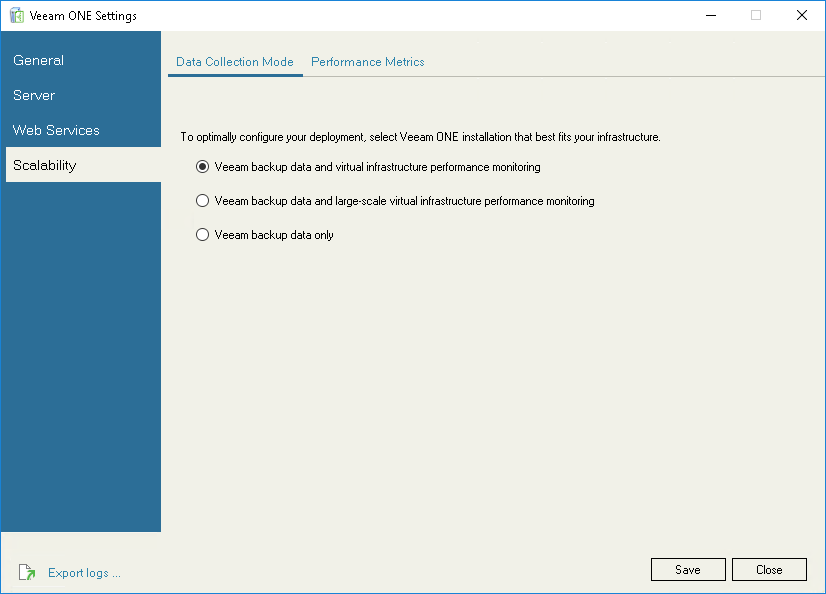
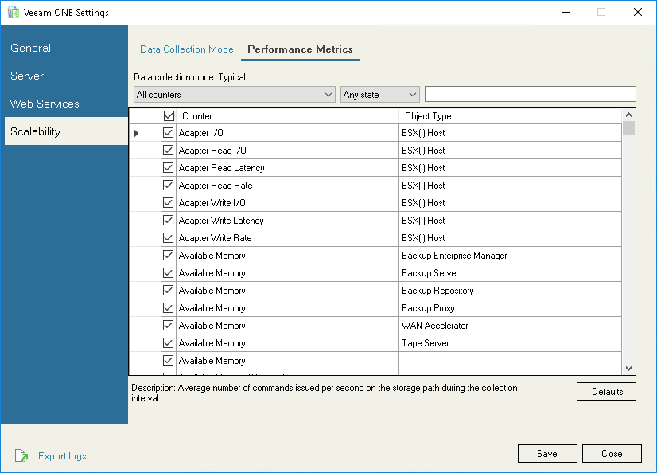

# Scalability

In the Scalability section, you can choose Veeam ONE data collection mode and metrics that Veeam ONE must collect.

This section includes the following tabs:

* [Data Collection Mode](utility_deployment.md#mode)
* [Performance Metrics](utility_deployment.md#metrics)

Data Collection ModeVeeam Cloud Connect

On the Data Collection Mode tab, you can choose Veeam ONE data collection mode. The data collection mode determines what metrics Veeam ONE must collect, and specifies the product configuration.

The selected mode also controls whether Veeam ONE collects performance metrics from separately added (external) Veeam Backup & Replication infrastructure components (backup proxies and backup repositories deployed on their own hosts).

For details on which modes collect these metrics, see [Step 12. Choose Data Collection Mode](typical_choose_collection_mode.md).

Data collection mode is specified during Veeam ONE installation. In some cases, you may need to change the data collection mode — for example, if you need to change the level of data granularity.

To change the data collection mode:

1. Select the necessary data collection option.

For details on data collection mode, see [Choose Data Collection Mode](typical_choose_collection_mode.md).

1. Click Save.

Performance Metrics

On the Performance metrics tab, you can explicitly define metrics that Veeam ONE must collect.

The list of metrics that Veeam ONE collects depends on the selected data collection mode. However, you can also manually add a number of performance metrics to that list.

To choose performance metrics that must be collected:

1. In the Counters drop-down list, select an infrastructure object to which metrics pertain.
2. In the State drop-down list, select the metrics state (Enabled, Disabled, Any state).
3. To quickly find the necessary metric, type the metric name in the search field on the right.
4. Select check boxes next to metrics that Veeam ONE must collect.
5. Click Save.

Click Defaults to restore Veeam ONE default settings for performance metrics, and select only those metrics that must be collected in accordance with the chosen data collection mode.

Page updated 2026-07-21

