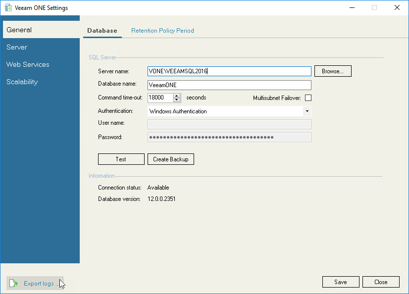

# Exporting Logs

Diagnostic logs include information that can be used by the Veeam Support Team to troubleshoot issues that occur in Veeam ONE. In addition, diagnostic logs include information about the managed virtual and backup infrastructures. This type of information is used to speed up the root cause analysis when troubleshooting issues.

Veeam ONE Settings utility allows you to export diagnostic logs for the Monitoring and Reporting services:

1. At the bottom left corner of the Veeam ONE Settings utility, click Export logs.
2. Specify a location where the exported logs must be saved.

The Veeam ONE Settings utility will export logs and save them to a ZIP archive in the specified location.

