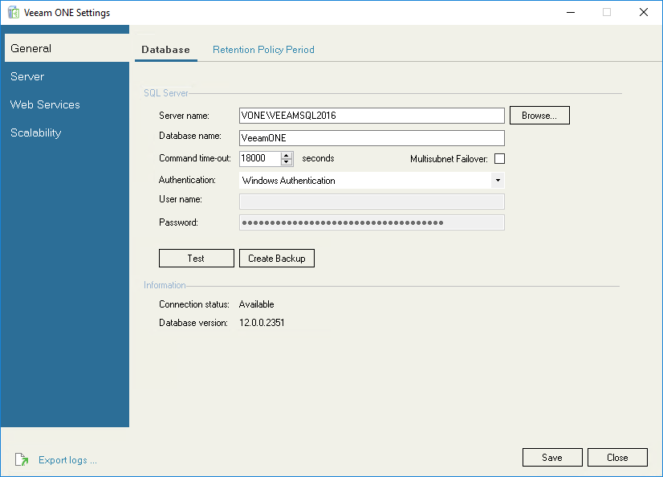
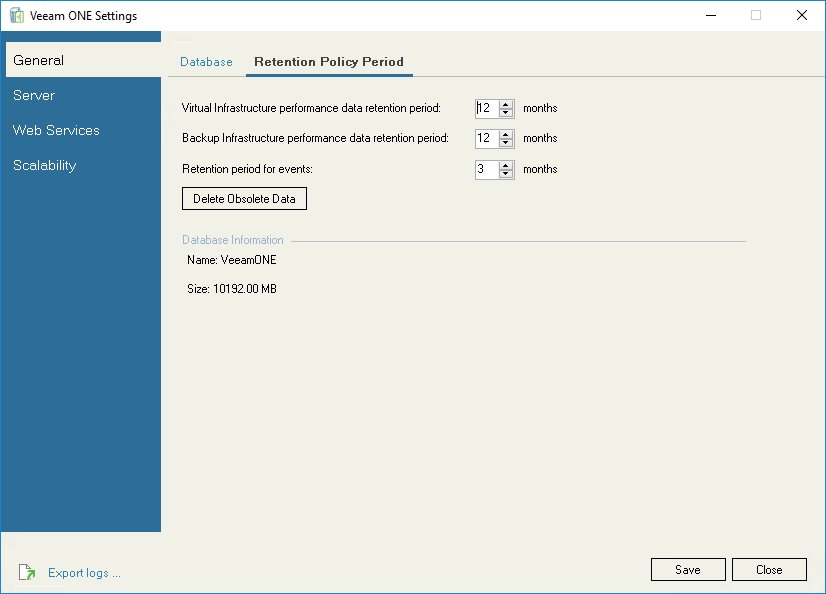

# General Settings

The General section groups configuration settings common for all Veeam ONE software components.

This section includes the following tabs:

* [Database](utility_general.md#db)
* [Retention Policy Period](utility_general.md#retention)

Database

On the Database tab, you can modify connection settings for the Veeam ONE database and the Microsoft SQL Server that hosts this database. By default, the fields are populated with the values specified during Veeam ONE installation.

To change database configuration settings:

1. In the Server name field, specify the name of the SQL Server that hosts the Veeam ONE database.
2. In the Database name field, specify the name of the database that stores Veeam ONE data.
3. In the Command time-out field, specify the wait time in seconds for a command to execute on the Veeam ONE database.

By default, the time-out value is set to 18000 seconds (5 hours).

Select the Multisubnet Failover check box, to enable failover in a SQL Server multi-subnet failover cluster.

1. From the Authentication list, select the type of authentication that Veeam ONE components must use to connect to the Microsoft SQL Server that hosts the Veeam ONE database:

* Select Windows Authentication to use Windows authentication credentials of the Veeam ONE service account.
* Select SQL Server Authentication to use Microsoft SQL Server account credentials.

1. [For SQL Server Authentication] In the User name/Password fields, specify credentials of the SQL account used to connect to the Microsoft SQL Server that hosts the Veeam ONE database.
2. Click Save to apply settings.
3. To check if Veeam ONE can connect to the specified database using the specified connection settings, click Test.

To back up the Veeam ONE database to a BAK file, click Create Backup and specify the location where the database backup file must be saved.

In the Information section, you can view the Veeam ONE connection status and version number.

Retention Policy Period

On the Retention Policy Period tab, you can modify the time period during which historical data is stored in the Veeam ONE database. By default, virtual and backup infrastructure performance data is retained for 12 months, and event data is stored for 3 months.

To modify the retention period:

* In the Virtual Infrastructure performance data retention period field, specify the period for storing virtual infrastructure performance data, in months.
* In the Backup Infrastructure performance data retention period field, specify the period for storing backup infrastructure performance data, in months.
* In the Retention period for events field, specify the period for storing events data, in months.

You can specify a value from 1 to 36.

Specified retention values will be applied at the end of the current week. To apply retention settings immediately, click Delete Obsolete Data.

