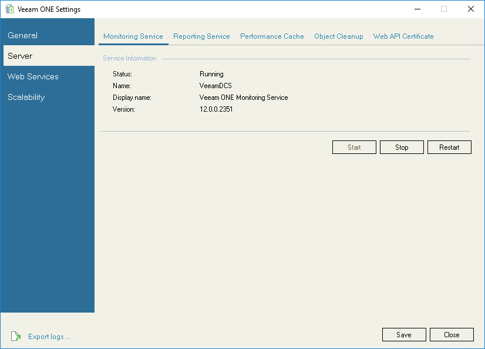
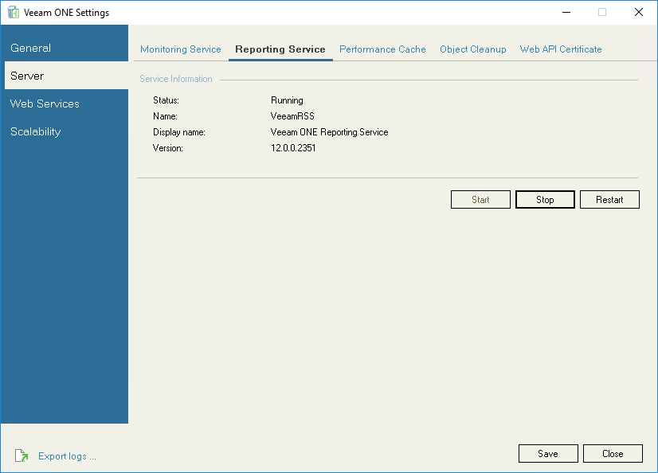
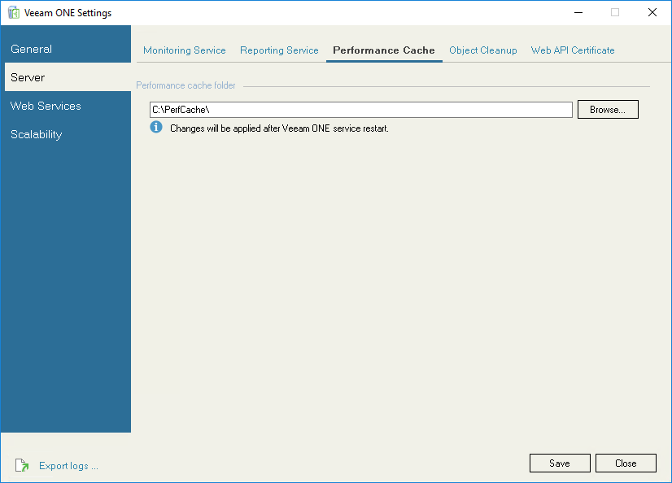
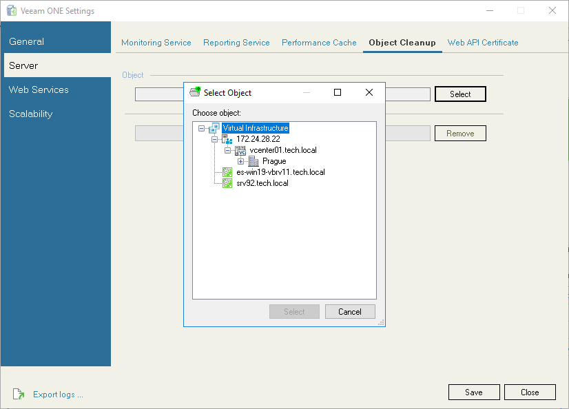

# Veeam ONE Server Settings

The Server section groups configuration settings for the Veeam ONE Server.

This section includes the following tabs:

* [Monitoring Service](#monitoring)
* [Reporting Service](#reporting)
* [Performance Cache](utility_monitor.md#cache)
* [Object Cleanup](#cleanup)
* [Web API Certificate](#certificate)

Monitoring Service

On the Monitoring Service tab, you can start, stop or restart the Veeam ONE Monitoring service. These operations may be required to complete Veeam ONE configuration updates.

Reporting Service

On the Reporting Service tab, you can start, stop or restart the Veeam ONE Reporting service. These operations may be required to complete Veeam ONE configuration updates.

Performance Cache

On the Performance Cache tab, you can change the path to the directory in which performance cache is stored. After you change the directory, switch to the Monitoring Service tab and restart Veeam ONE Monitoring service.

The initial directory to store performance cache is specified during installation.

Object Cleanup

On the Object Cleanup tab, you can remove residual data on deleted infrastructure objects from the Veeam ONE database.

In some cases, data collected from infrastructure objects remain in the Veeam ONE database even if connections to these infrastructure objects are removed in the Veeam ONE Client. As a result, residual data may appear in Veeam ONE reports.

To clean data on obsolete infrastructure objects from the Veeam ONE database:

1. Click Select and choose an infrastructure object for which data must be removed.
2. Click Remove and wait for completion of the object data cleanup.

Web API Certificate

On the Web API Certificate tab, you can view and manage a TLS certificate used to establish a secure connection between Veeam ONE components. By default, Veeam ONE uses a self-signed certificate generated during installation or upgrade. For more information on types of certificates supported by Veeam ONE, see [Veeam ONE Certificates](veeam_one_certificates.md).

The Certificate Information section displays summary details of the currently installed certificate. To see detailed information on the certificate, click View.

