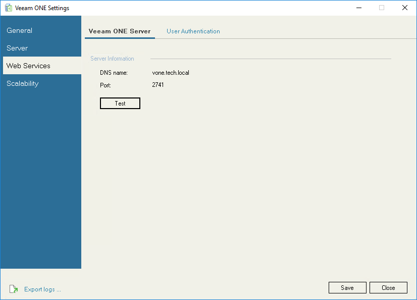
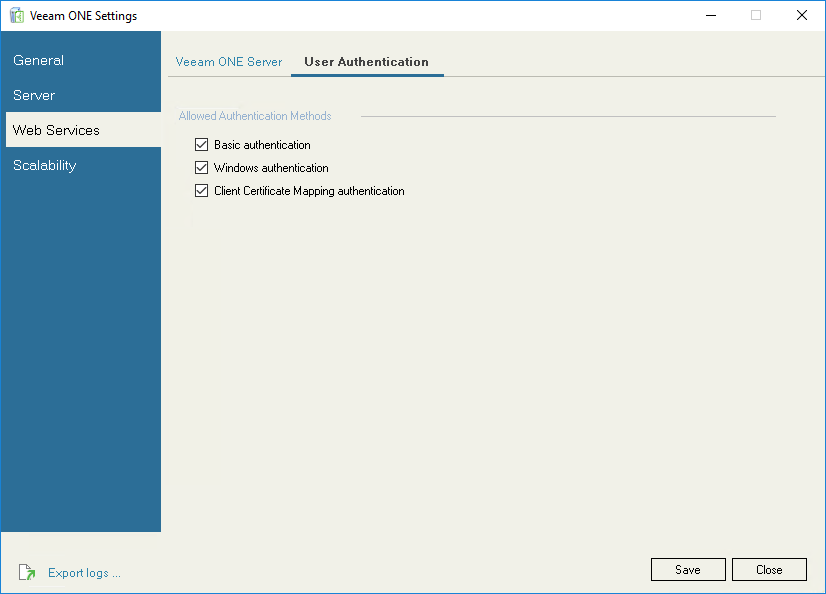

# Veeam ONE Web Settings

In the Web Services section, you can view Veeam ONE Server connection details and configure.

Veeam ONE Server

On the Veeam ONE Server tab, you can review the connection details of the machine where Veeam ONE Server components are installed. This may be required if you installed Veeam ONE using the distributed deployment scenario. Click Test, to check connection between Veeam ONE Server and Web Services.

User Authentication

On the User Authentication tab, you can select which methods are allowed to authenticate users in Veeam ONE Web Client:

* Basic authentication — select this method to allow users to log in with user name and password.
* Windows authentication — select this method to allow users to log in with credentials of a Windows user account under which the user is logged on to the machine.
* Client Certificate Mapping authentication — select this method to allow users to log in with a client certificate.

For more information, see [Configuring Client Certificate Mapping Authentication](#cert).

Configuring Client Certificate Mapping Authentication

To allow users to log in to Veeam ONE Web Client with multi-factor authentication (MFA) through client certificate configuration, do the following on the machine that hosts Veeam ONE Web UI component:

* Enable Active Directory Client Certificate Authentication on the IIS.

For details on Client Certificate Mapping Authentication settings, see [this Microsoft article](https://learn.microsoft.com/en-us/iis/configuration/system.webserver/security/authentication/clientcertificatemappingauthentication).

* If you have non-self-signed certificates in the Trusted Root Certificate Authorities store, move them to the Intermediate Certification Authorities store.
* If Veeam ONE Web UI component runs on Windows Server 2022, you must disable TLS 1.3 over TCP in the site binding settings.

